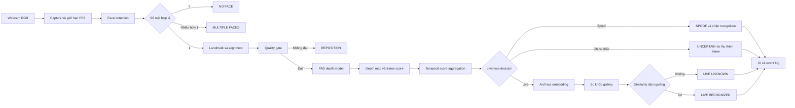
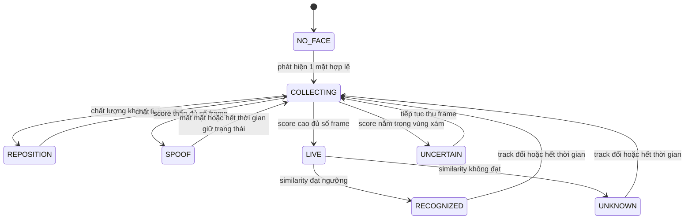

# Đặc tả đề tài hệ thống nhận diện khuôn mặt thời gian thực có chống giả mạo bằng ước lượng bản đồ độ sâu

**Tên tiếng Anh:** Real time Face Recognition System with Presentation Attack Detection using Depth Map Estimation  
**Loại đề tài:** Đồ án học phần Computer Vision  
**Phạm vi:** Nghiên cứu và xây dựng nguyên mẫu chạy cục bộ trên máy tính  
**Phiên bản tài liệu:** 1.0  
**Ngày cập nhật:** 17 tháng 9 năm 2026

**Kế hoạch triển khai theo từng buổi học:** [KE_HOACH_THUC_HIEN_THEO_BUOI_HOC.md](KE_HOACH_THUC_HIEN_THEO_BUOI_HOC.md)

---

## Cách sử dụng tài liệu

Đây là tài liệu điều hướng triển khai, không phải yêu cầu nhóm làm đồng thời mọi mục. Cách dùng đề nghị:

1. Cả nhóm đọc mục 1 đến mục 8 để thống nhất bài toán, phạm vi và kiến trúc.
2. Người phụ trách dữ liệu làm theo mục 10, 11 và các checklist ở phụ lục A.
3. Người phụ trách mô hình làm theo mục 9, 12, 13 và 14.
4. Người phụ trách ứng dụng làm theo mục 9, 15 đến 20.
5. Cả nhóm dùng mục 21 và 31 làm Definition of Done trước khi báo hoàn thành.
6. Nếu trễ tiến độ, giảm phạm vi đúng thứ tự ở mục 32.

Đường đi ngắn nhất để có MVP:

```text
Chuẩn bị protocol và manifest
    -> chạy binary baseline
    -> sinh và kiểm tra pseudo depth
    -> train DepthNet
    -> train CDCN
    -> khóa threshold trên validation
    -> tích hợp ArcFace
    -> đặt PAD trước recognition
    -> thêm temporal median
    -> đo metric và latency
    -> demo và phân tích lỗi
```

### Mục lục theo nhóm công việc

- **Định nghĩa đề tài:** mục 1 đến 7.
- **Kiến trúc và thuật toán:** mục 8 và 9.
- **Dữ liệu và huấn luyện:** mục 10 đến 12.
- **Thí nghiệm và đánh giá:** mục 13 và 14.
- **Đặc tả phần mềm:** mục 15 đến 20.
- **Nghiệm thu và tiến độ:** mục 21 đến 24.
- **Tối ưu, đạo đức và rủi ro:** mục 25 đến 28.
- **Báo cáo, demo và hoàn tất:** mục 29 đến 33 và các phụ lục.

---

## 1. Tóm tắt quyết định thiết kế

Nhóm sẽ xây dựng một nguyên mẫu nhận diện khuôn mặt từ webcam có hai tầng quyết định độc lập:

1. **Presentation Attack Detection hay PAD:** xác định khuôn mặt trước camera là người thật hay là một mẫu tấn công trình diện, tập trung vào ảnh in và video phát lại trên màn hình.
2. **Face Recognition:** chỉ so khớp danh tính sau khi PAD xác nhận mẫu đang quan sát là thật.

Hệ thống sử dụng camera RGB thông thường của máy tính. Không yêu cầu camera chiều sâu, camera hồng ngoại, máy chủ, cơ sở dữ liệu doanh nghiệp, ứng dụng di động hoặc hạ tầng đám mây. Bản đồ độ sâu trong đề tài là **độ sâu tương đối được suy ra từ ảnh RGB đơn mắt**, không phải phép đo độ sâu vật lý từ cảm biến.

Hướng triển khai được khuyến nghị:

- Phát hiện và căn chỉnh khuôn mặt bằng SCRFD hoặc RetinaFace.
- Trích xuất embedding nhận diện bằng ArcFace đã huấn luyện sẵn.
- Xây dựng ba cấu hình PAD để so sánh công bằng:
  - Baseline 1: ResNet18 phân loại thật và giả bằng Binary Cross Entropy.
  - Baseline 2: mạng DepthNet dùng convolution thông thường để hồi quy bản đồ độ sâu.
  - Mô hình chính: Central Difference Convolutional Network hay CDCN, học bản đồ độ sâu bằng Absolute Depth Loss và Contrastive Depth Loss.
- Tạo nhãn độ sâu giả bằng 3DDFA V2 cho mẫu thật; nhãn của ảnh in và video phát lại là bản đồ gần 0.
- Tổng hợp điểm PAD trên một cửa sổ nhiều khung hình để giảm rung quyết định khi chạy webcam.
- Chọn ngưỡng trên tập validation, khóa ngưỡng, sau đó mới đánh giá một lần trên test.

Đây là thiết kế cân bằng giữa giá trị học thuật, khả năng chạy được và thời gian của một đồ án nhỏ. Mục tiêu không phải là tuyên bố hệ thống an toàn ở cấp sản phẩm hoặc đạt state of the art trên mọi loại tấn công.

---

## 2. Bối cảnh và động cơ

Một hệ thống nhận diện khuôn mặt thông thường có thể xác định đúng danh tính xuất hiện trong một tấm ảnh, nhưng không biết tấm ảnh đó đến từ khuôn mặt thật đang hiện diện hay từ ảnh chân dung được in ra hoặc phát lại trên điện thoại. PAD bổ sung bước kiểm tra tính chân thực của mẫu đầu vào trước khi cho phép nhận diện.

Các phương pháp PAD chỉ phân loại nhị phân thường học những dấu hiệu dễ nhưng kém tổng quát như màu nền, camera, độ nén hoặc viền màn hình. Học có giám sát phụ trợ bằng bản đồ độ sâu buộc mô hình học cấu trúc không gian cục bộ của khuôn mặt: khuôn mặt thật có hình học lồi lõm tương đối, trong khi ảnh in và nội dung trên màn hình gần phẳng. CDCN tăng khả năng mô hình hóa biến thiên cường độ và gradient cục bộ, phù hợp với các dấu hiệu vi mô của giả mạo. Bài báo CDCN công bố kết quả mạnh trên nhiều bộ dữ liệu PAD và cung cấp mã nghiên cứu; bài báo FAS SGTD cho thấy lợi ích của kết hợp độ sâu với thông tin không gian và thời gian.

Tuy nhiên, depth map không giải quyết tất cả vấn đề. Mặt nạ 3D có hình học thật, ảnh cong có thể không phẳng, mô hình 3D reconstruction có thể sinh ra khuôn mặt nổi ngay cả từ ảnh giả, và mô hình có thể dựa vào texture thay vì hình học. Vì vậy tài liệu này coi depth map là **tín hiệu giám sát có ích cho PAD ảnh in và replay**, không phải bằng chứng tuyệt đối về sự sống.

---

## 3. Mục tiêu đề tài

### 3.1 Mục tiêu tổng quát

Xây dựng, kiểm thử và trình diễn một pipeline hoàn chỉnh chạy thời gian thực trên máy tính, có khả năng:

- Phát hiện và theo dõi khuôn mặt từ webcam.
- Phân biệt tương đối giữa khuôn mặt thật và hai loại tấn công cơ bản là ảnh in và video phát lại.
- Nhận diện một số thành viên đã đăng ký khi mẫu vượt qua PAD.
- Hiển thị bản đồ độ sâu dự đoán, điểm liveness, danh tính và độ tương đồng.
- Đánh giá định lượng nhiều mô hình PAD trên cùng dữ liệu, cùng split và cùng quy trình.
- Phân tích các trường hợp đúng, sai, điểm mạnh, điểm yếu và giới hạn tổng quát hóa.

### 3.2 Mục tiêu học tập

Sau đề tài, nhóm cần giải thích và chứng minh được:

- Sự khác nhau giữa face detection, face alignment, face verification, face identification và PAD.
- Vì sao phải chia dữ liệu theo subject hoặc video, không chia ngẫu nhiên theo frame.
- Vì sao ngưỡng phải được chọn trên validation thay vì test.
- Sự khác nhau giữa classification supervision, pixel wise supervision và depth supervision.
- Vai trò của Central Difference Convolution và Contrastive Depth Loss.
- Cách kết hợp quyết định theo nhiều frame trong một hệ thống thời gian thực.
- Cách đọc các metric APCER, BPCER, ACER, EER, FAR, FRR, ROC AUC và latency.
- Vì sao kết quả trong cùng bộ dữ liệu thường tốt hơn đáng kể so với khác bộ dữ liệu.

### 3.3 Câu hỏi nghiên cứu

Đề tài phải trả lời ít nhất bốn câu hỏi sau:

1. Depth supervision có cải thiện PAD so với binary classification trên cùng dữ liệu và cùng preprocessing không?
2. CDCN có cải thiện hơn convolution thông thường khi cả hai cùng hồi quy depth map không?
3. Tổng hợp điểm trên nhiều frame có giảm false decision và dao động nhãn so với dự đoán từng frame không?
4. Thêm PAD ảnh hưởng thế nào đến độ trễ và FPS của pipeline nhận diện khuôn mặt?

Khuyến khích trả lời thêm:

5. Một mô hình huấn luyện trên một bộ dữ liệu có tổng quát sang bộ khác hoặc sang webcam của nhóm không?
6. Những điều kiện nào làm depth prediction hoặc recognition thất bại nhiều nhất?

### 3.4 Giả thuyết nghiên cứu

- H1: DepthNet có ACER thấp hơn binary baseline khi được đánh giá đúng protocol.
- H2: CDCN có ACER thấp hơn DepthNet dùng convolution thông thường.
- H3: Median hoặc trimmed mean trên cửa sổ thời gian cho quyết định ổn định hơn single frame.
- H4: PAD làm giảm FPS nhưng pipeline vẫn đạt mức tương tác được trên máy tính của nhóm.

---

## 4. Phạm vi và giới hạn

### 4.1 Phạm vi bắt buộc

- Một khuôn mặt chính trong khung hình.
- Camera RGB tích hợp hoặc webcam USB.
- Tấn công ảnh in và replay bằng điện thoại hoặc màn hình máy tính.
- Chạy cục bộ, giao diện cửa sổ OpenCV hoặc giao diện tối giản tương đương.
- Tập danh tính nhỏ, dự kiến 3 đến 10 người trong nhóm hoặc lớp, chỉ dùng cho demo recognition.
- Huấn luyện và đánh giá PAD trên bộ dữ liệu nghiên cứu có protocol rõ ràng.
- So sánh tối thiểu ba cấu hình PAD.
- Lưu kết quả thí nghiệm thành CSV hoặc JSON và sinh biểu đồ phục vụ báo cáo.

### 4.2 Ngoài phạm vi

- Không triển khai hệ thống kiểm soát ra vào thật.
- Không lưu trữ sinh trắc học trên cloud.
- Không xây dựng API công khai, microservice, Docker Swarm hoặc Kubernetes.
- Không tối ưu cho hàng trăm nghìn danh tính.
- Không huấn luyện ArcFace từ đầu.
- Không tuyên bố chống được mặt nạ 3D, deepfake thời gian thực, makeup, partial attack, adversarial attack hoặc mọi thiết bị replay chưa thấy.
- Không yêu cầu camera depth, IR, thermal hoặc cảm biến chuyên dụng.
- Không coi accuracy cao trên dữ liệu tự thu là bằng chứng về an toàn thực tế.

### 4.3 Phạm vi mở rộng nếu còn thời gian

- Mô hình thời gian nhẹ dùng 5 đến 8 frame liên tiếp.
- Thử nghiệm cross dataset.
- Xuất mô hình PAD sang ONNX và so sánh PyTorch với ONNX Runtime.
- So sánh SCRFD và RetinaFace về tốc độ hoặc độ ổn định.
- Bổ sung quality gate theo blur, pose và kích thước mặt.
- Thêm Grad CAM hoặc visualization feature map để giải thích mô hình.

### 4.4 Tiêu chí không mở rộng

Nếu MVP chưa tái lập được, nhóm không làm thêm web app, mobile app, database server, tracking nhiều người, liveness challenge bằng cử động hoặc mô hình Transformer lớn. Các phần này không trực tiếp trả lời câu hỏi nghiên cứu chính và làm tăng rủi ro không hoàn thành.

---

## 5. Thuật ngữ và quy ước

| Thuật ngữ | Ý nghĩa trong đề tài |
|---|---|
| Bona fide hoặc live | Mẫu khuôn mặt thật được camera thu trực tiếp |
| Presentation attack | Đưa một vật hoặc nội dung thay thế khuôn mặt thật trước cảm biến |
| Print attack | Ảnh chân dung in trên giấy, phẳng hoặc hơi cong |
| Replay attack | Ảnh hoặc video khuôn mặt được phát trên điện thoại, tablet hoặc màn hình |
| PAD | Presentation Attack Detection, mô đun phân biệt bona fide và attack |
| Liveness score | Điểm liên tục; càng cao càng thiên về bona fide theo quy ước của dự án |
| Depth map | Bản đồ độ sâu tương đối trong vùng khuôn mặt, chuẩn hóa về khoảng từ 0 đến 1 |
| Pseudo depth | Depth map được mô hình 3D face reconstruction sinh tự động, không phải ground truth cảm biến |
| Embedding | Vector biểu diễn khuôn mặt do mô hình nhận diện tạo ra |
| Enrollment | Đăng ký danh tính bằng cách lưu embedding tham chiếu |
| Verification | So sánh một mẫu với một danh tính được khai báo |
| Identification | Tìm danh tính gần nhất trong gallery hoặc trả về unknown |
| Subject disjoint | Một người chỉ xuất hiện trong đúng một split train, validation hoặc test |
| Video disjoint | Các frame của một video không bị phân tán sang nhiều split |

Quy ước nhãn đề nghị:

- `label = 1`: bona fide hoặc live.
- `label = 0`: presentation attack.
- `liveness_score` càng lớn càng thiên về live.
- Mọi module phải dùng cùng quy ước; test phải phát hiện trường hợp đảo nhãn.

---

## 6. Đối tượng sử dụng và kịch bản

### 6.1 Đối tượng sử dụng

- Thành viên nhóm phát triển và nghiên cứu.
- Giảng viên hoặc sinh viên xem demo.
- Người chạy thí nghiệm từ dòng lệnh.

### 6.2 Kịch bản chính

**UC01 Đăng ký danh tính**

1. Người dùng nhập tên định danh.
2. Hệ thống thu một số frame hợp lệ trong nhiều góc nhỏ.
3. Hệ thống phát hiện, căn chỉnh và trích xuất embedding.
4. Embedding được chuẩn hóa L2 và tổng hợp thành template.
5. Template được lưu cục bộ cùng metadata, không lưu ảnh nếu không cần.

**UC02 Nhận diện người thật**

1. Camera thu hình khuôn mặt.
2. Hệ thống kiểm tra chất lượng và PAD trên nhiều frame.
3. Khi đủ bằng chứng live, hệ thống chạy hoặc công bố kết quả recognition.
4. Nếu similarity vượt ngưỡng, hiển thị tên; nếu không, hiển thị `UNKNOWN`.

**UC03 Chặn ảnh in**

1. Ảnh in của người đã đăng ký được đưa trước webcam.
2. Face detector vẫn có thể phát hiện mặt.
3. PAD phải ưu tiên trả về `SPOOF`.
4. Hệ thống không được hiển thị kết quả nhận diện như một truy cập hợp lệ.

**UC04 Chặn video replay**

Tương tự UC03 nhưng mẫu được phát trên màn hình. Thí nghiệm cần thay đổi độ sáng, khoảng cách và thiết bị hiển thị nếu có thể.

**UC05 Không đủ chất lượng**

Nếu mặt quá nhỏ, quá mờ, lệch góc lớn hoặc bị che nhiều, hệ thống trả về `REPOSITION` hoặc `UNCERTAIN`, không ép thành live hay spoof.

**UC06 Nhiều khuôn mặt**

MVP chọn khuôn mặt có bounding box lớn nhất và hiển thị cảnh báo `MULTIPLE_FACES`. Không dùng kết quả làm một quyết định truy cập.

---

## 7. Mô hình đe dọa

### 7.1 Tấn công được nghiên cứu

| Mã | Tấn công | Trong MVP | Ghi chú |
|---|---|---:|---|
| A1 | Ảnh in phẳng | Có | Trắng đen và màu nếu có điều kiện |
| A2 | Ảnh in hơi cong | Nên có | Kiểm tra giả định mặt phẳng |
| A3 | Ảnh tĩnh trên điện thoại | Có | Có thể tạo moire và phản xạ |
| A4 | Video replay trên điện thoại | Có | Có chuyển động tự nhiên từ video gốc |
| A5 | Replay trên màn hình laptop | Nên có | Thay đổi kích thước và độ sáng |
| A6 | Mặt nạ 3D | Không | Nêu như giới hạn nghiên cứu |
| A7 | Deepfake thời gian thực | Không | Khác với presentation attack cơ bản |
| A8 | Tấn công vào file hoặc code | Không | Không thuộc lớp tấn công tại cảm biến |

### 7.2 Giả định vận hành

- Camera không bị chiếm quyền điều khiển.
- Pipeline nhận frame trực tiếp, không nhận file do người dùng tùy ý thay thế trong chế độ demo.
- Chỉ một người chủ động tương tác tại một thời điểm.
- Ánh sáng trong phòng đủ để thấy khuôn mặt.
- Khuôn mặt chủ yếu chính diện hoặc lệch nhẹ.

### 7.3 Quy tắc an toàn của pipeline

- PAD phải đứng trước quyết định recognition về mặt logic.
- Khi PAD là `SPOOF`, `UNCERTAIN`, `NO_FACE` hoặc `MULTIPLE_FACES`, kết quả cuối không được là `ACCEPT`.
- Không dùng chung một ngưỡng cho mọi mô hình nếu phân phối score khác nhau.
- Không chọn ngưỡng bằng test set.
- Không quảng bá kết quả demo thành chứng nhận an toàn.

---

## 8. Kiến trúc tổng thể



### 8.1 Nguyên tắc tách mô đun

- Detector và aligner không biết nhãn live hoặc spoof.
- PAD không cần biết danh tính.
- Recognition không tự quyết định live.
- Bộ tổng hợp thời gian nhận score liên tục, không nhận ảnh thô.
- UI chỉ hiển thị state do controller phát ra; UI không tự suy luận.
- Evaluator sử dụng cùng preprocessing với inference nhưng không dùng logic UI.

### 8.2 Trạng thái hệ thống



---

## 9. Thiết kế từng mô đun

### 9.1 Thu nhận hình ảnh

Đầu vào mặc định là webcam index 0, độ phân giải 1280 x 720 hoặc 640 x 480 tùy máy. Không cần xử lý mọi frame. Controller có thể đọc camera ở 30 FPS nhưng chỉ chạy detector hoặc PAD theo chu kỳ để giữ giao diện mượt.

Yêu cầu:

- Ghi nhận timestamp bằng clock đơn điệu.
- Nếu đọc camera thất bại liên tiếp 30 frame, dừng an toàn và báo lỗi.
- Cho phép mirror chỉ ở lớp hiển thị; ảnh đưa vào model phải có quy ước nhất quán với training.
- Không âm thầm đổi color order; OpenCV là BGR trong khi đa số model nhận RGB.
- Lưu width, height và source FPS trong metadata của phiên demo.

### 9.2 Phát hiện và căn chỉnh khuôn mặt

Khuyến nghị dùng SCRFD từ hệ sinh thái InsightFace vì tốc độ và độ chính xác tốt; RetinaFace là lựa chọn thay thế có giá trị để nhóm đọc và so sánh. ArcFace và RetinaFace có triển khai chính thức trong InsightFace. Không cần huấn luyện detector.

Quy trình:

1. Chạy detector và lấy bounding box, confidence, 5 landmarks.
2. Loại detection có confidence nhỏ hơn ngưỡng cấu hình.
3. Mở rộng box khoảng 20 đến 30 phần trăm để PAD thấy viền mặt và vật liệu trình diện.
4. Tạo hai crop từ cùng detection:
   - `pad_crop`: giữ context vừa đủ, resize về 256 x 256.
   - `recognition_crop`: similarity transform theo 5 landmarks, resize 112 x 112.
5. Khi có nhiều mặt, chọn mặt lớn nhất để hiển thị nhưng state cuối là `MULTIPLE_FACES` trong MVP.

Không dùng crop quá chặt cho PAD vì có thể làm mất viền giấy, moire và texture vùng lân cận. Không dùng crop quá rộng vì mô hình dễ học nền.

### 9.3 Quality gate

Quality gate không phải PAD. Nó chỉ từ chối đầu vào mà các model khó xử lý đáng tin cậy.

Các kiểm tra đề nghị:

- Kích thước cạnh ngắn của mặt tối thiểu 120 pixel trong frame gốc.
- Tỷ lệ box nằm trong ảnh trên 95 phần trăm.
- Blur score bằng variance of Laplacian lớn hơn ngưỡng chọn từ validation nội bộ.
- Yaw và pitch ở mức vừa phải nếu model landmark cung cấp pose.
- Độ sáng trung bình không quá tối hoặc cháy sáng.
- Không có che khuất lớn ở vùng mắt, mũi và miệng nếu có cách kiểm tra đơn giản.

Mọi ngưỡng quality phải để trong file cấu hình. Nếu chưa có dữ liệu để hiệu chỉnh, nhóm dùng giá trị khởi tạo, ghi rõ là heuristic và không tính các mẫu bị quality gate loại vào kết quả PAD chính nếu protocol dataset không quy định như vậy.

### 9.4 Face recognition

#### 9.4.1 Mô hình

Dùng ArcFace pretrained để sinh embedding, ưu tiên backbone nhẹ hoặc trung bình có thể chạy trên máy nhóm. ArcFace học embedding với additive angular margin, phù hợp cho so khớp cosine. Không huấn luyện lại ArcFace vì việc này yêu cầu dữ liệu nhiều danh tính và không phải trọng tâm PAD.

#### 9.4.2 Enrollment

- Thu 15 đến 30 frame hợp lệ cho mỗi người trong 10 đến 20 giây.
- Chỉ nhận frame qua quality gate; trong demo hoàn chỉnh nên yêu cầu PAD live.
- Loại embedding outlier bằng cosine similarity với medoid hoặc centroid sơ bộ.
- L2 normalize từng embedding.
- Lấy trung bình các embedding còn lại và L2 normalize lần nữa để tạo template.
- Lưu `person_id`, `display_name`, model version, thời gian tạo, số mẫu và vector.

Không dùng cùng frame cho enrollment và đánh giá recognition.

#### 9.4.3 Matching

Với embedding truy vấn chuẩn hóa `q` và template chuẩn hóa `g_i`:

```text
similarity_i = q dot g_i
predicted_id = argmax_i similarity_i
```

Nếu similarity lớn nhất nhỏ hơn `recognition_threshold`, trả về `UNKNOWN`. Ngưỡng phải chọn từ validation gồm genuine pairs và impostor pairs của chính tập demo, không sao chép mù quáng một ngưỡng từ Internet.

### 9.5 PAD bằng binary classification

Đây là baseline tối thiểu để kiểm tra dataset và pipeline.

- Backbone: ResNet18 hoặc MobileNetV3 Small.
- Input: `pad_crop` 224 x 224 hoặc 256 x 256.
- Output: một logit live.
- Loss: `BCEWithLogitsLoss`, có class weight nếu dữ liệu lệch.
- Score: sigmoid của logit.

Baseline này dễ triển khai nhưng có thể học shortcut như camera, nền, viền màn hình hoặc độ nén. Vì vậy mọi split và augmentation phải giống các mô hình depth để so sánh có ý nghĩa.

### 9.6 PAD bằng hồi quy bản đồ độ sâu

#### 9.6.1 Nhãn độ sâu

Với ảnh bona fide, chạy 3DDFA V2 để ước lượng bề mặt 3D khuôn mặt và render depth map trong vùng mặt. Với ảnh tấn công phẳng, tạo map 0 có cùng kích thước. Cách giám sát pseudo depth này bám theo dòng công trình auxiliary depth supervision và CDCN.

Quy trình chuẩn hóa nhãn bona fide:

1. Tái sử dụng đúng crop và phép biến đổi hình học của input.
2. Render depth ở vùng mặt.
3. Tạo face mask hợp lệ.
4. Đặt pixel ngoài mặt bằng 0.
5. Chuẩn hóa robust trong vùng mặt, ví dụ dùng percentile 5 và 95 rồi clip về 0 đến 1.
6. Downsample về kích thước output của model, đề nghị 32 x 32.
7. Lưu PNG 16 bit hoặc NumPy float cùng metadata về generator version.

Đối với spoof:

- MVP dùng map 0 cho print và replay.
- Không dùng quy tắc map 0 để tuyên bố xử lý mask 3D.
- Nếu 3DDFA thất bại trên live, đánh dấu sample invalid; không tự đổi nó thành spoof.

#### 9.6.2 DepthNet baseline

DepthNet dùng các convolution thông thường, nhiều mức feature và một head sinh map 1 x 32 x 32. Mục đích là tách lợi ích của depth supervision khỏi lợi ích của Central Difference Convolution.

#### 9.6.3 CDCN

CDCN thay một phần convolution bằng Central Difference Convolution, kết hợp thông tin cường độ với sai khác cục bộ. Kiến trúc tạo depth map và có thể trả về feature trung gian cho visualization.

Một biểu diễn khái niệm của CDC là:

```text
y(p0) = sum_pn w(pn) * x(p0 + pn)
        - theta * x(p0) * sum_pn w(pn)
```

Trong đó `theta` điều chỉnh mức đóng góp của thành phần sai khác trung tâm. Giá trị phải được cấu hình và kiểm chứng bằng ablation, không hard code rải rác.

#### 9.6.4 Hàm mất mát

Absolute depth loss:

```text
L_abs = mean absolute error D_pred và D_gt
```

Contrastive depth loss so sánh gradient cục bộ của hai map theo tám hướng lân cận:

```text
L_contrast = mean squared error K(D_pred) và K(D_gt)
```

Loss tổng:

```text
L_depth = lambda_abs * L_abs + lambda_contrast * L_contrast
```

Nếu thêm classification head:

```text
L_total = L_depth + lambda_cls * BCEWithLogitsLoss(logit, label)
```

MVP ưu tiên tái lập `L_abs + L_contrast`. Classification head là ablation, không được thay đổi kiến trúc giữa các run mà không ghi lại.

#### 9.6.5 Chuyển depth map thành liveness score

Không chỉ lấy một pixel. Tính score từ vùng mặt hợp lệ:

```text
depth_energy = mean(D_pred * face_mask) trong vùng mask
liveness_score = calibrated(depth_energy)
```

Có thể thử thêm độ lệch chuẩn hoặc contrast energy, nhưng phải chọn công thức trên validation. Nếu mô hình có classification head, đánh giá riêng score của head và score depth energy trước khi fusion.

### 9.7 Tổng hợp theo thời gian

MVP không cần huấn luyện video model. Dùng cửa sổ score giúp ổn định với chi phí thấp.

Thiết kế mặc định:

- Cửa sổ 12 lần suy luận PAD gần nhất.
- Cần ít nhất 8 frame hợp lệ.
- Loại score khi track mất, quality gate fail hoặc detection đổi đột ngột.
- Aggregate bằng median hoặc trimmed mean 20 phần trăm.
- Dùng hai ngưỡng có vùng xám:
  - `score >= tau_live`: live.
  - `score <= tau_spoof`: spoof.
  - Giữa hai ngưỡng: uncertain.
- `tau_spoof` phải nhỏ hơn `tau_live`.
- Giữ trạng thái tối thiểu vài trăm mili giây để UI không nhấp nháy.

So sánh bắt buộc:

- Single frame.
- Mean window.
- Median window.

FAS SGTD là hướng tham khảo cho học đặc trưng không gian và thời gian, nhưng chỉ làm phiên bản temporal learning nếu phần frame based đã hoàn chỉnh.

### 9.8 Controller và chính sách quyết định

Pseudocode chuẩn:

```python
frame = camera.read()
faces = detector.detect(frame)

if len(valid_faces) == 0:
    return NO_FACE
if len(valid_faces) > 1:
    return MULTIPLE_FACES

pad_crop, recognition_crop = align_and_crop(frame, faces[0])
if not quality_gate(pad_crop, faces[0]):
    return REPOSITION

depth_map, frame_score = pad_model(pad_crop)
state, temporal_score = temporal_aggregator.update(frame_score)

if state == SPOOF:
    return SPOOF
if state != LIVE:
    return UNCERTAIN

embedding = recognition_model(recognition_crop)
person_id, similarity = gallery.match(embedding)
if similarity < recognition_threshold:
    return LIVE_UNKNOWN
return LIVE_RECOGNIZED(person_id)
```

Tối ưu hợp lệ: có thể tính embedding song song hoặc cache nội bộ để giảm trễ, nhưng controller tuyệt đối không công bố kết quả nhận diện trước khi state là `LIVE`.

### 9.9 Giao diện demo

Giao diện cần hiển thị vừa đủ cho mục đích học tập:

- Frame webcam và bounding box.
- State hiện tại bằng chữ lớn.
- Liveness score và ngưỡng.
- Tên hoặc `UNKNOWN` và cosine similarity khi live.
- FPS trung bình trượt.
- Thumbnail depth map dự đoán.
- Hướng dẫn ngắn như `Đưa mặt gần hơn`, `Giữ yên`, `Phát hiện nhiều khuôn mặt`.

Màu gợi ý:

- Xám: no face hoặc collecting.
- Vàng: uncertain hoặc reposition.
- Đỏ: spoof.
- Xanh lá: live recognized.
- Xanh dương: live unknown.

Không dùng màu làm tín hiệu duy nhất; luôn có nhãn chữ.

---

## 10. Dữ liệu

### 10.1 Lựa chọn bộ dữ liệu

Ưu tiên theo thứ tự:

1. **OULU NPU** nếu trường hoặc giảng viên có thể ký EULA. Bộ dữ liệu gồm 4950 video thật và tấn công, có protocol đánh giá theo điều kiện, thiết bị và phương tiện tấn công. Protocol 1 là điểm bắt đầu phù hợp; Protocol 4 khó hơn và dùng khi nhóm còn thời gian.
2. **Replay Attack** nếu cần bộ nhỏ và quy trình truy cập thuận tiện hơn. Bộ này có 1300 video của 50 người với ảnh và video attack trong các điều kiện ánh sáng khác nhau.
3. **CASIA MFSD** dùng làm cross dataset hoặc lựa chọn thay thế, không trộn tùy tiện với bộ chính.
4. **Dữ liệu tự thu** chỉ dùng cho demo định tính hoặc một thí nghiệm riêng có mô tả rõ, không thay cho benchmark chuẩn.

Không tải dataset từ nguồn chia sẻ không rõ giấy phép. Dữ liệu không được commit vào Git.

### 10.2 Chiến lược phạm vi dữ liệu

Phương án tối thiểu khả thi:

- Một benchmark PAD chính.
- Protocol chính thức nếu có.
- Lấy 8 đến 12 frame mỗi video cho train, phân bố đều theo thời gian.
- Validation và test có thể lấy nhiều frame hơn nhưng phải cố định chiến lược giữa các model.
- Một bộ webcam nhỏ của nhóm để demo print và replay dưới 2 đến 3 điều kiện ánh sáng.

### 10.3 Chống rò rỉ dữ liệu

Các quy tắc bắt buộc:

- Split theo protocol của dataset.
- Nếu tự tạo split, split theo subject trước, sau đó mới trích frame.
- Tất cả frame của một video phải thuộc cùng split.
- Không dùng test để chọn checkpoint, threshold, augmentation hoặc hyperparameter.
- Nếu pseudo depth được cache, đường dẫn cache phải chứa split và checksum của source.
- Không để cùng một nội dung video với hai mức nén xuất hiện ở train và test.
- Dữ liệu tự thu cho recognition phải tách phiên enrollment và phiên evaluation.

### 10.4 Manifest dữ liệu

Mọi sample sau preprocessing được mô tả bằng một dòng CSV:

```csv
sample_id,dataset,split,protocol,subject_id,video_id,frame_index,image_path,depth_path,label,attack_type,device,session
oulu_train_000001,oulu,train,P1,subject_01,video_001,45,data/processed/frames/...,data/processed/depth/...,1,bona_fide,phone_1,session_1
```

Yêu cầu:

- `sample_id` duy nhất.
- Đường dẫn tương đối với data root.
- `label` theo quy ước 1 live, 0 spoof.
- `attack_type` không để trống; dùng `unknown_attack` nếu metadata không có.
- Script validate manifest phải kiểm tra file tồn tại, nhãn hợp lệ, trùng sample và rò rỉ subject hoặc video.

### 10.5 Cấu trúc dữ liệu đề nghị

```text
data/
├── README.md
├── raw/                    # không commit
│   ├── oulu_npu/
│   └── replay_attack/
├── interim/                # frame và crop tạm
├── processed/
│   ├── images/
│   ├── depth_maps/
│   └── masks/
└── manifests/
    ├── train.csv
    ├── val.csv
    └── test.csv
```

### 10.6 Sinh pseudo depth

Pipeline offline:


QA pseudo depth phải kiểm tra:

- Tỷ lệ 3DDFA thất bại theo split và theo nhãn.
- Phân phối min, max, mean của map.
- Map live không rỗng.
- Map spoof gần 0 theo đúng quy ước.
- Crop ảnh và map thẳng hàng.
- Visualize ngẫu nhiên ít nhất 100 cặp image và depth hoặc toàn bộ nếu dữ liệu nhỏ.

### 10.7 Dữ liệu tự thu

Nếu thu dữ liệu cho demo, cần sự đồng ý của người tham gia. Mỗi người nên có:

- 2 phiên live khác thời điểm.
- 2 điều kiện ánh sáng.
- Khoảng cách gần, vừa và xa.
- 1 ảnh in màu nếu có thể.
- 1 replay ảnh tĩnh và 1 replay video.
- Ít nhất 2 thiết bị trình diện nếu nhóm có sẵn, không mua phần cứng chỉ để hoàn thành đề tài.

Dùng phiên 1 cho enrollment hoặc hiệu chỉnh nội bộ, phiên 2 cho demo evaluation. Không công bố ảnh khuôn mặt nếu chưa được phép.

---

## 11. Tiền xử lý và augmentation

### 11.1 Tiền xử lý chung

- Decode frame và chuyển BGR sang RGB đúng một lần.
- Detect trên frame gốc hoặc bản resize có lưu scale.
- Crop theo box đã mở rộng.
- Resize PAD bằng bilinear; resize label depth bằng bilinear hoặc area theo kích thước.
- Chuẩn hóa input theo mean và standard deviation được khai báo trong config.
- Không áp normalization của ArcFace lên PAD crop hoặc ngược lại.

### 11.2 Augmentation cho PAD

Augmentation đề nghị cho train:

- Horizontal flip.
- Color jitter mức nhẹ.
- Random brightness và contrast mức vừa phải.
- JPEG compression ngẫu nhiên.
- Gaussian blur nhẹ với xác suất thấp.
- Random resized crop nhỏ.
- Random erasing hoặc cutout nhỏ, dùng như một ablation nếu cần.

Không dùng:

- Vertical flip.
- Biến dạng hình học cực mạnh làm sai cấu trúc mặt.
- Augmentation chỉ áp lên image nhưng không biến đổi tương ứng depth map.
- Augmentation tạo dấu hiệu khác nhau rõ rệt giữa live và spoof.

Mọi biến đổi hình học phải đồng bộ giữa RGB, depth và face mask.

### 11.3 Sampling

- Sampling theo video trước, không để video dài thống trị batch.
- Batch cân bằng live và spoof nếu có thể.
- Với nhiều attack type, dùng sampler giúp mỗi epoch thấy các loại attack tương đối cân bằng.
- Không đếm hàng nghìn frame gần giống nhau như hàng nghìn quan sát độc lập khi báo cáo confidence.

---

## 12. Thiết kế huấn luyện

### 12.1 Môi trường

Khuyến nghị:

- Python 3.11.
- PyTorch và torchvision tương thích với nhau.
- OpenCV, NumPy, pandas, scikit learn, matplotlib hoặc seaborn.
- ONNX và ONNX Runtime chỉ cần cho phần mở rộng.
- CUDA là tùy chọn; pipeline phải có chế độ CPU, dù huấn luyện trên CPU có thể chậm.

Nhóm phải khóa dependency bằng `requirements-lock.txt`, `uv.lock` hoặc file môi trường sau khi smoke test thành công. Không ghi một danh sách version tùy ý trước khi kiểm tra máy thật.

### 12.2 Cấu hình mặc định khởi đầu

Đây là điểm bắt đầu, không phải kết quả tối ưu mặc định:

| Tham số | Binary baseline | DepthNet | CDCN |
|---|---:|---:|---:|
| Input | 224 hoặc 256 | 256 | 256 |
| Output | 1 logit | 32 x 32 map | 32 x 32 map |
| Optimizer | AdamW | AdamW | AdamW |
| Learning rate | 1e-4 | 1e-4 | 1e-4 |
| Weight decay | 1e-4 | 1e-5 đến 1e-4 | 1e-5 đến 1e-4 |
| Batch size | 16 đến 64 | 8 đến 32 | 8 đến 32 |
| Epoch tối đa | 30 đến 50 | 30 đến 50 | 30 đến 50 |
| Early stopping | val ACER | val ACER | val ACER |
| Seed | 3 seed cố định | cùng seed | cùng seed |

Nếu máy yếu, giảm batch size trước khi giảm độ phân giải. Dùng gradient accumulation nếu cần. Không so sánh model được huấn luyện với budget quá khác nhau mà không ghi rõ.

### 12.3 Vòng lặp huấn luyện

Mỗi run phải:

1. Đọc một file config bất biến.
2. Ghi commit hash nếu repo có Git.
3. Ghi seed, môi trường, GPU hoặc CPU, dataset manifest checksum.
4. Train trên train split.
5. Tính metric ở mức video trên validation sau mỗi epoch hoặc theo chu kỳ.
6. Chọn checkpoint theo validation ACER hoặc EER đã định trước.
7. Lưu `last.ckpt` và `best.ckpt`.
8. Không chạy test trong quá trình tinh chỉnh.
9. Sau khi khóa cấu hình và threshold, chạy test một lần cho bảng kết quả cuối.

### 12.4 Tính score ở mức video

Metric benchmark phải tính theo đơn vị mà protocol yêu cầu. Với video dataset:

1. Dự đoán score cho các frame đã chọn.
2. Aggregate thành video score bằng mean hoặc median được chọn trên validation.
3. Dùng video score để tính APCER, BPCER, ACER và EER.

Không báo cáo frame accuracy như kết quả chính nếu protocol đánh giá theo video.

### 12.5 Tái lập

- Chạy tối thiểu 3 seed cho ba model chính nếu thời gian cho phép.
- Báo cáo mean và standard deviation.
- Bật deterministic mode khi khả thi và ghi chú các operator không deterministic.
- Mọi biểu đồ phải được sinh từ file kết quả, không nhập số bằng tay.
- Mỗi run có thư mục riêng và không ghi đè checkpoint tốt.

---

## 13. Thiết kế thí nghiệm

### 13.1 Ma trận thí nghiệm bắt buộc

| ID | Mô hình | Supervision | Temporal | Mục đích |
|---|---|---|---|---|
| E0 | Majority hoặc constant baseline | Nhãn | Không | Kiểm tra metric và class balance |
| E1 | ResNet18 | Binary label | Không | Baseline classification |
| E2 | DepthNet | Pseudo depth | Không | Đo lợi ích depth supervision |
| E3 | CDCN | Pseudo depth | Không | Mô hình chính |
| E4 | CDCN | Pseudo depth | Mean window | Đo lợi ích temporal aggregation |
| E5 | CDCN | Pseudo depth | Median window | So sánh độ ổn định |

### 13.2 Ablation ưu tiên

Thực hiện theo thứ tự nếu còn thời gian:

| ID | Thay đổi | Câu hỏi |
|---|---|---|
| A1 | CDCN chỉ dùng absolute loss | Contrastive depth loss có giúp không? |
| A2 | CDCN dùng absolute và contrastive loss | Cấu hình chính |
| A3 | `theta = 0` | CDCN trở về gần convolution thường ra sao? |
| A4 | Không augmentation và có augmentation | Mức tổng quát hóa thay đổi thế nào? |
| A5 | Tight crop và expanded crop | Context quanh mặt có giúp hay tạo shortcut? |
| A6 | Single frame và rolling window | Độ ổn định real time thay đổi thế nào? |
| A7 | Depth energy và classification head | Cách tạo score nào tốt hơn? |

### 13.3 Cross dataset tùy chọn

Train trên bộ A, chọn threshold trên validation của A, test trực tiếp trên bộ B mà không fine tune. Báo cáo HTER, AUC hoặc metric được tài liệu tham chiếu sử dụng. Kết quả giảm mạnh là bình thường và là bằng chứng quan trọng về domain shift.

### 13.4 Thí nghiệm recognition

- Closed set identification: tất cả người test đều có trong gallery.
- Open set nhỏ: thêm ít nhất 2 người không có trong gallery để kiểm tra `UNKNOWN`.
- Genuine pairs: cùng người, khác phiên.
- Impostor pairs: khác người.
- Chọn threshold trên validation pairs.
- Báo cáo ROC, EER, FAR, FRR và top 1 accuracy cho closed set.

### 13.5 Thí nghiệm end to end

Ma trận demo tối thiểu:

| Tình huống | Số lần thử tối thiểu mỗi người | Kỳ vọng |
|---|---:|---|
| Live chính diện, sáng bình thường | 10 | Live và đúng danh tính |
| Live hơi lệch trái hoặc phải | 10 | Live, recognition có thể giảm nhẹ |
| Live ánh sáng yếu | 10 | Live hoặc reposition, không ưu tiên spoof sai |
| Ảnh in người đã đăng ký | 10 | Spoof |
| Ảnh trên điện thoại | 10 | Spoof |
| Video replay | 10 | Spoof |
| Người chưa đăng ký | 10 | Live unknown |
| Không có mặt | 1 phút | No face, không có accept giả |

Mỗi lần thử phải reset cửa sổ temporal để các lần không ảnh hưởng nhau.

---

## 14. Chỉ số đánh giá

### 14.1 PAD

Theo tinh thần ISO IEC 30107 3 về kiểm thử và báo cáo PAD:

- **APCER:** tỷ lệ attack bị phân loại nhầm thành bona fide.
- **BPCER:** tỷ lệ bona fide bị phân loại nhầm thành attack.
- **ACER:** trung bình của APCER và BPCER, thường dùng trong nhiều protocol PAD.
- **EER:** điểm mà error của hai phía gần bằng nhau.
- **ROC AUC:** khả năng xếp hạng live cao hơn spoof trên toàn bộ ngưỡng.
- **HTER:** trung bình FAR và FRR theo cách dùng trong một số thử nghiệm cross dataset.

Với quy ước score cao là live:

```text
APCER(t) = số attack có score >= t / tổng attack
BPCER(t) = số live có score < t / tổng live
ACER(t)  = APCER(t) + BPCER(t) chia 2
```

Phải ghi rõ:

- Đơn vị là frame hay video.
- Cách chọn threshold.
- Cách xử lý no response hoặc sample invalid.
- Attack type nào có trong test.
- Mean và standard deviation nếu chạy nhiều seed.

Accuracy và F1 có thể báo cáo bổ sung, không thay thế APCER và BPCER.

### 14.2 Recognition

- Cosine similarity distribution cho genuine và impostor.
- FAR hoặc false accept rate.
- FRR hoặc false reject rate.
- EER.
- TAR tại một hoặc vài FAR đã chọn nếu số cặp đủ lớn.
- Top 1 accuracy cho closed set.
- Unknown detection rate cho open set nhỏ.

Vì gallery nhỏ, không nên báo số thập phân quá chi tiết hoặc suy diễn sang quy mô lớn.

### 14.3 Toàn hệ thống

- Tỷ lệ live được nhận diện đúng.
- Tỷ lệ live bị chặn bởi PAD.
- Tỷ lệ spoof vượt qua PAD.
- Tỷ lệ spoof vừa vượt PAD vừa match đúng nạn nhân, đây là end to end attack success rate.
- Time to decision từ khi có mặt hợp lệ đến state ổn định.
- Latency p50 và p95 của detector, PAD, recognition và toàn pipeline.
- FPS hiển thị và FPS suy luận.
- Peak RAM và VRAM nếu có công cụ đo.
- Tỷ lệ thời gian ở state uncertain.

### 14.4 Hiệu chỉnh ngưỡng

Quy trình chuẩn:

1. Sinh score của validation.
2. Chọn mục tiêu, ví dụ ACER nhỏ nhất hoặc APCER không vượt một mức định trước.
3. Lưu ngưỡng vào artifact của run.
4. Khóa model và ngưỡng.
5. Chạy test đúng một lần.

Không dùng ngưỡng 0.5 chỉ vì output qua sigmoid. Score của depth energy không phải xác suất đã hiệu chỉnh.

### 14.5 Báo cáo uncertainty

Nếu có đủ video, bootstrap theo video hoặc subject để tạo confidence interval. Không bootstrap theo frame vì các frame cùng video tương quan mạnh. Với dữ liệu rất nhỏ, báo số lần đúng trên tổng số bên cạnh phần trăm.

---

## 15. Yêu cầu chức năng

| ID | Yêu cầu | Mức ưu tiên | Tiêu chí kiểm tra |
|---|---|---:|---|
| FR001 | Mở và đọc webcam | Must | Hiển thị liên tục ít nhất 10 phút không crash |
| FR002 | Phát hiện khuôn mặt | Must | Trả box, score và landmarks |
| FR003 | Căn chỉnh crop recognition | Must | Crop 112 x 112 có mắt và mũi đúng vị trí |
| FR004 | Tạo crop PAD | Must | Crop 256 x 256, giữ context và không vượt ảnh |
| FR005 | Quality gate | Must | Từ chối mặt quá nhỏ hoặc quá mờ |
| FR006 | Chạy binary PAD baseline | Must | Sinh score và metric trên validation |
| FR007 | Sinh pseudo depth | Must | Live có map hợp lệ, spoof có zero map |
| FR008 | Train DepthNet | Must | Có checkpoint, log và depth visualization |
| FR009 | Train CDCN | Must | Có checkpoint, log và metric chuẩn |
| FR010 | Aggregate PAD nhiều frame | Must | Mean và median có test |
| FR011 | Chặn recognition khi không live | Must | Test tích hợp khẳng định không có accept |
| FR012 | Đăng ký danh tính | Must | Lưu template và metadata cục bộ |
| FR013 | So khớp và trả unknown | Must | Có threshold validation |
| FR014 | Hiển thị state và depth map | Must | Demo rõ ràng, không nhấp nháy quá mức |
| FR015 | Ghi event log | Must | JSONL hoặc CSV có timestamp và score |
| FR016 | Đánh giá PAD theo video | Must | Sinh APCER, BPCER, ACER, EER, AUC |
| FR017 | Đo latency | Must | Có p50 và p95 từng stage |
| FR018 | Export ONNX | Could | Output gần tương đương PyTorch |
| FR019 | Cross dataset | Could | Không fine tune trên target test |

---

## 16. Yêu cầu phi chức năng

| ID | Yêu cầu | Mục tiêu cho đồ án |
|---|---|---|
| NFR001 | Khả năng tái lập | Cùng config và seed tạo metric gần tương đương |
| NFR002 | Tốc độ | Mục tiêu trải nghiệm ít nhất 10 FPS hiển thị; PAD có thể chạy thưa hơn |
| NFR003 | Độ trễ quyết định | Mục tiêu dưới 2 giây khi mặt rõ và máy đủ khả năng |
| NFR004 | Tính mô đun | Detector, PAD, recognition, evaluator thay độc lập được |
| NFR005 | Cấu hình hóa | Path, threshold, model, device, window không hard code |
| NFR006 | Quan sát được | Log lỗi, score, latency và model version |
| NFR007 | Riêng tư | Mặc định không lưu frame webcam |
| NFR008 | Khả năng chạy CPU | Có chế độ CPU, chấp nhận chậm hơn |
| NFR009 | Kiểm thử | Unit test metric, split, transforms và state machine |
| NFR010 | Tài liệu | Một người mới có thể chạy preprocessing, train, eval và demo theo README |

Các mục tiêu FPS và latency chỉ là mục tiêu kỹ thuật nội bộ, phải đo trên máy nhóm và báo rõ cấu hình máy.

---

## 17. Giao diện module và dữ liệu

### 17.1 Kiểu dữ liệu cốt lõi

```python
@dataclass
class FaceDetection:
    bbox_xyxy: np.ndarray
    landmarks_5: np.ndarray
    confidence: float

@dataclass
class PADResult:
    frame_score: float
    temporal_score: float | None
    state: str
    depth_map: np.ndarray | None
    valid: bool
    reason: str | None

@dataclass
class RecognitionResult:
    person_id: str | None
    display_name: str | None
    similarity: float | None
    is_unknown: bool

@dataclass
class PipelineResult:
    timestamp_ms: int
    state: str
    detection: FaceDetection | None
    pad: PADResult | None
    recognition: RecognitionResult | None
    latency_ms: dict[str, float]
```

### 17.2 Contract quan trọng

- `PADModel.predict` luôn trả score theo hướng cao là live.
- `TemporalAggregator.reset` được gọi khi mất track, đổi camera hoặc bắt đầu lượt thử mới.
- `Recognizer.match` chỉ được controller gọi để phát hành kết quả khi state live.
- `Evaluator` phải nhận raw score, không nhận nhãn đã threshold để còn vẽ ROC.
- Mọi model artifact đi cùng config và checksum.

### 17.3 Event log

Ví dụ JSONL:

```json
{"ts":"2026-09-17T10:15:31.245+07:00","session_id":"demo_001","state":"LIVE_RECOGNIZED","face_count":1,"quality_ok":true,"pad_frame_score":0.91,"pad_temporal_score":0.88,"pad_threshold_live":0.73,"identity":"student_01","similarity":0.62,"recognition_threshold":0.47,"latency_ms":{"detect":18.4,"pad":12.1,"recognition":7.2,"total":41.9}}
```

Không ghi embedding hoặc frame vào log mặc định.

### 17.4 Cấu hình mẫu

```yaml
project:
  seed: 42
  device: auto

camera:
  index: 0
  width: 1280
  height: 720
  display_mirror: true

detector:
  name: scrfd
  confidence_threshold: 0.60
  max_faces: 1

quality:
  min_face_size_px: 120
  min_blur_score: 60.0
  min_brightness: 35
  max_brightness: 225

pad:
  model: cdcn
  checkpoint: artifacts/pad/cdcn/best.ckpt
  input_size: 256
  score_method: depth_mean
  spoof_threshold: 0.45
  live_threshold: 0.70
  temporal:
    method: median
    window_size: 12
    min_valid_frames: 8

recognition:
  model: arcface
  gallery_path: artifacts/gallery/gallery.npz
  similarity: cosine
  threshold: 0.47

privacy:
  save_frames: false
  save_embeddings_in_log: false
```

Các số threshold trong ví dụ chỉ để thể hiện cấu trúc. Nhóm phải thay bằng giá trị lấy từ validation.

---

## 18. Cấu trúc mã nguồn đề nghị

```text
DeepFace-PAD/
├── README.md
├── DAC_TA_HE_THONG_NHAN_DIEN_KHUON_MAT_PAD_DEPTH_MAP.md
├── pyproject.toml
├── requirements-lock.txt
├── configs/
│   ├── data/
│   ├── model/
│   │   ├── binary_resnet18.yaml
│   │   ├── depthnet.yaml
│   │   └── cdcn.yaml
│   ├── experiment/
│   └── demo.yaml
├── data/
│   ├── README.md
│   └── manifests/
├── src/
│   └── deepface_pad/
│       ├── data/
│       │   ├── dataset.py
│       │   ├── transforms.py
│       │   ├── sampling.py
│       │   └── validation.py
│       ├── depth/
│       │   ├── generator.py
│       │   ├── normalize.py
│       │   └── quality.py
│       ├── models/
│       │   ├── binary_baseline.py
│       │   ├── depthnet.py
│       │   ├── cdcn.py
│       │   └── losses.py
│       ├── face/
│       │   ├── detector.py
│       │   ├── aligner.py
│       │   ├── recognizer.py
│       │   └── gallery.py
│       ├── pipeline/
│       │   ├── controller.py
│       │   ├── quality_gate.py
│       │   ├── temporal.py
│       │   └── state.py
│       ├── evaluation/
│       │   ├── pad_metrics.py
│       │   ├── recognition_metrics.py
│       │   ├── latency.py
│       │   └── reports.py
│       └── utils/
│           ├── config.py
│           ├── logging.py
│           └── reproducibility.py
├── scripts/
│   ├── prepare_dataset.py
│   ├── generate_depth_maps.py
│   ├── validate_manifest.py
│   ├── train_pad.py
│   ├── evaluate_pad.py
│   ├── enroll_face.py
│   ├── evaluate_recognition.py
│   ├── run_webcam.py
│   └── benchmark_runtime.py
├── tests/
│   ├── unit/
│   ├── integration/
│   └── fixtures/
├── artifacts/              # không commit model lớn
├── reports/
│   ├── figures/
│   └── tables/
└── runs/                   # không commit
```

---

## 19. Giao diện dòng lệnh dự kiến

```bash
# Kiểm tra môi trường và camera
python -m deepface_pad.cli doctor

# Chuẩn bị frame và manifest theo protocol
python scripts/prepare_dataset.py --config configs/data/oulu_p1.yaml

# Sinh pseudo depth và báo cáo QA
python scripts/generate_depth_maps.py --manifest data/manifests/train.csv

# Phát hiện rò rỉ hoặc file hỏng
python scripts/validate_manifest.py --data-dir data/manifests

# Train ba mô hình
python scripts/train_pad.py --config configs/experiment/e1_binary.yaml
python scripts/train_pad.py --config configs/experiment/e2_depthnet.yaml
python scripts/train_pad.py --config configs/experiment/e3_cdcn.yaml

# Hiệu chỉnh trên validation
python scripts/evaluate_pad.py --split val --run runs/e3_cdcn_seed42 --calibrate

# Đánh giá test sau khi khóa ngưỡng
python scripts/evaluate_pad.py --split test --run runs/e3_cdcn_seed42

# Đăng ký và đánh giá nhận diện
python scripts/enroll_face.py --person-id student_01 --display-name "Thanh vien 01"
python scripts/evaluate_recognition.py --config configs/recognition_eval.yaml

# Chạy webcam
python scripts/run_webcam.py --config configs/demo.yaml

# Đo tốc độ
python scripts/benchmark_runtime.py --config configs/demo.yaml --warmup 50 --frames 500
```

CLI thực tế có thể khác, nhưng bốn luồng `prepare`, `train`, `evaluate`, `demo` phải tách biệt.

---

## 20. Kế hoạch kiểm thử

### 20.1 Unit test

| Thành phần | Test bắt buộc |
|---|---|
| Label convention | Score live cao hơn spoof trong fixture giả lập |
| Metric PAD | So sánh APCER, BPCER, ACER với ví dụ tính tay |
| EER | Không lỗi khi score trùng nhau hoặc chỉ có ít mẫu |
| Split validator | Phát hiện cùng subject hoặc video ở nhiều split |
| Transform | RGB và depth nhận cùng flip, crop, resize |
| Depth normalization | Không NaN khi map hằng hoặc mask rỗng |
| Contrastive loss | Output hữu hạn, backward thành công |
| Gallery | L2 normalization và cosine đúng |
| Temporal window | Reset đúng và không dùng score invalid |
| State machine | Spoof không thể chuyển trực tiếp thành recognized |
| Config | Thiếu threshold hoặc checkpoint phải báo lỗi rõ |

### 20.2 Integration test

- Video live mẫu đi hết detector, PAD và recognition.
- Video spoof mẫu không phát hành recognition result.
- Không có mặt không làm pipeline crash.
- Hai mặt tạo state `MULTIPLE_FACES`.
- Checkpoint sai shape báo lỗi trước khi mở webcam.
- Chạy CPU khi không có CUDA.
- Kết quả batch evaluator và online inference gần nhau trên cùng frame.

### 20.3 Test dữ liệu

- Kiểm tra đường dẫn, checksum và số lượng theo split.
- Không có frame trùng perceptual hash giữa train và test ở mức bất thường.
- Thống kê live và spoof theo subject, device, attack type.
- Visualize batch sau augmentation.
- Kiểm tra histogram depth live và spoof.

### 20.4 Test hồi quy

Lưu một bộ fixture nhỏ không chứa dữ liệu nhạy cảm hoặc dùng ảnh được phép. Khi thay preprocessing hoặc model loader:

- Output shape không đổi.
- Score không lệch vượt tolerance đã định.
- Latency không tăng quá mức mà không có giải thích.
- Metric script vẫn tái lập bảng kết quả cũ trong sai số cho phép.

---

## 21. Tiêu chí nghiệm thu

### 21.1 Nghiệm thu MVP

Đề tài được coi là hoàn thành khi tất cả điều kiện sau đạt:

- [ ] Có manifest train, validation và test không rò rỉ subject hoặc video.
- [ ] Có script sinh pseudo depth và báo cáo QA.
- [ ] Train được binary baseline, DepthNet và CDCN.
- [ ] Mỗi model có config, log, checkpoint và raw score.
- [ ] Có bảng APCER, BPCER, ACER, EER và AUC ở mức video.
- [ ] Threshold được chọn trên validation và test chỉ dùng đánh giá cuối.
- [ ] Có visualization RGB, ground truth depth và predicted depth.
- [ ] ArcFace enrollment và matching hoạt động với unknown threshold.
- [ ] Pipeline webcam không công bố recognized khi PAD chưa xác nhận live.
- [ ] Demo được ít nhất live, print attack, replay attack và unknown person.
- [ ] Có latency p50, p95 và FPS trên máy nhóm.
- [ ] README đủ để một thành viên khác chạy lại.
- [ ] Báo cáo nêu rõ giới hạn đối với mask 3D và domain shift.

### 21.2 Mức kết quả kỳ vọng hợp lý

Không đặt một ACER cố định như điều kiện qua môn vì kết quả phụ thuộc dataset, protocol và máy. Thay vào đó, yêu cầu:

- E1, E2 và E3 được đánh giá công bằng.
- E3 không nhất thiết thắng mọi run; nếu không thắng, nhóm phải phân tích nguyên nhân bằng dữ liệu và visualization.
- Demo có tính ổn định đủ quan sát, không cần đạt chuẩn sản phẩm.
- Kết luận dựa trên metric và error analysis, không chỉ dựa trên video demo đẹp.

---

## 22. Kế hoạch thực hiện sáu tuần

### Tuần 1 Nền tảng và dữ liệu

- Đọc tài liệu ArcFace, CDCN, auxiliary depth supervision và protocol dataset.
- Chốt dataset và hoàn tất thủ tục truy cập.
- Tạo cấu trúc repo, môi trường, config và logging.
- Chạy detector, alignment và ArcFace pretrained trên ảnh mẫu.
- Xây manifest validator trước khi trích nhiều frame.

**Đầu ra:** môi trường tái lập, dataset plan, camera smoke test, manifest mẫu.

### Tuần 2 Chuẩn bị dữ liệu và baseline

- Trích frame theo protocol.
- Xây augmentation đồng bộ.
- Train binary baseline.
- Viết metric APCER, BPCER, ACER, EER và AUC.
- Kiểm tra đánh giá ở mức video.

**Đầu ra:** E0 và E1, bảng dữ liệu, ROC đầu tiên.

### Tuần 3 Pseudo depth và DepthNet

- Tích hợp 3DDFA V2 offline.
- Sinh, chuẩn hóa và kiểm tra depth map.
- Train DepthNet.
- Sinh figure input, target, prediction và error map.

**Đầu ra:** depth cache đạt QA, E2 và phân tích lỗi ban đầu.

### Tuần 4 CDCN và ablation chính

- Triển khai CDC layer và CDCN.
- Unit test loss và backward.
- Train E3 với cùng budget.
- Chạy A1 hoặc A3 để kiểm chứng thành phần contrastive hay central difference.

**Đầu ra:** E3, ít nhất một ablation, bảng so sánh chính.

### Tuần 5 Pipeline thời gian thực

- Xây state machine, temporal aggregation và quality gate.
- Xây enrollment và gallery.
- Kết nối PAD trước recognition.
- Đo latency, xử lý CPU hoặc CUDA.
- Thử live, print, phone replay và unknown.

**Đầu ra:** demo end to end, E4 và E5, runtime benchmark.

### Tuần 6 Đánh giá và báo cáo

- Khóa config và threshold.
- Chạy test cuối với các seed đã chọn.
- Tổng hợp biểu đồ, confusion cases và limitation.
- Tập dượt demo có phương án video dự phòng.
- Kiểm tra README và chạy lại từ môi trường sạch nếu có thể.

**Đầu ra:** báo cáo, slide, bảng số cuối, demo và tag release.

### Cổng kiểm soát tiến độ

- Không sang DepthNet nếu binary baseline và evaluator chưa đúng.
- Không sang CDCN nếu pseudo depth chưa qua QA.
- Không làm UI đẹp nếu pipeline offline chưa có metric.
- Không chạy test cuối nếu threshold còn thay đổi.

---

## 23. Phân công nhóm gợi ý

Với nhóm bốn người:

| Vai trò | Trách nhiệm chính | Trách nhiệm chéo |
|---|---|---|
| Thành viên A | Dữ liệu, protocol, manifest, pseudo depth | Review evaluator |
| Thành viên B | Binary baseline, DepthNet, CDCN và loss | Review tests dữ liệu |
| Thành viên C | Detector, alignment, ArcFace, gallery | Review pipeline PAD |
| Thành viên D | Controller, temporal, UI, benchmark runtime | Review recognition |

Tất cả thành viên phải hiểu end to end pipeline. Mỗi pull request quan trọng có ít nhất một người khác review. Nếu nhóm có ba người, gộp recognition với pipeline. Nếu nhóm có năm người, tách evaluator và báo cáo thí nghiệm thành vai trò riêng.

---

## 24. Quản lý thí nghiệm và artifact

Mỗi run có cấu trúc:

```text
runs/E3_cdcn_seed42_20260917_1015/
├── config.resolved.yaml
├── environment.txt
├── manifest_checksums.json
├── train.log
├── metrics_history.csv
├── best.ckpt
├── last.ckpt
├── val_scores.csv
├── thresholds.json
├── test_scores.csv
├── metrics.json
└── figures/
```

Quy tắc đặt tên:

- Chứa experiment ID, model, seed và timestamp.
- Không dùng tên `final`, `final2`, `best_new`.
- Bảng kết quả phải chỉ rõ run ID.
- Checkpoint lớn và dataset không commit Git.
- Commit code, config, manifest metadata, metric và script tạo figure.

### 24.1 Bảng kết quả chuẩn

```text
Model | Params | FLOPs | APCER | BPCER | ACER | EER | AUC | Latency p50 | FPS
```

Thêm cột mean và standard deviation nếu chạy nhiều seed. Không so FLOPs nếu công cụ tính không hỗ trợ custom CDC một cách đúng đắn; khi đó ghi `N/A` và báo latency đo thật.

### 24.2 Error analysis

Mỗi model cần tối thiểu:

- 20 false live hoặc toàn bộ nếu ít hơn.
- 20 false spoof hoặc toàn bộ nếu ít hơn.
- Phân nhóm theo attack type, device, ánh sáng, pose, blur và kích thước mặt.
- Xem predicted depth map và input crop cạnh nhau.
- Kiểm tra mô hình có tập trung vào nền hoặc viền thiết bị không.

---

## 25. Tối ưu thời gian thực

Thực hiện sau khi có pipeline đúng:

1. Profile từng stage bằng warmup và đồng bộ CUDA trước khi đo.
2. Chạy detector mỗi 2 đến 3 frame, dùng tracking nhẹ giữa các lần nếu cần.
3. Chạy PAD theo tần suất cố định, ví dụ 10 lần mỗi giây.
4. Chỉ chạy recognition khi temporal PAD đạt live và track ổn định.
5. Cache embedding trong một khoảng ngắn cho cùng track.
6. Dùng `torch.inference_mode` và model `eval`.
7. Thử mixed precision trên GPU sau khi so output.
8. Chuyển ONNX chỉ khi PyTorch pipeline đã đúng.

Không tối ưu bằng cách giảm cửa sổ temporal đến mức quyết định một frame hoặc bỏ quality gate mà không đo ảnh hưởng.

---

## 26. Quyền riêng tư, đạo đức và giấy phép

- Khuôn mặt và embedding là dữ liệu sinh trắc học nhạy cảm trong ngữ cảnh thực tế.
- Chỉ thu dữ liệu từ người đã đồng ý và cho phép rút lại dữ liệu.
- Mặc định không lưu video webcam trong chế độ demo.
- Nếu cần lưu mẫu lỗi, bật cờ rõ ràng, giới hạn thời gian lưu và xóa sau khi phân tích.
- Không công bố dataset hoặc pretrained weight nếu giấy phép không cho phép.
- Ghi rõ model pretrained và điều kiện sử dụng. InsightFace lưu ý rằng mã và các model hoặc dữ liệu huấn luyện có thể có điều kiện giấy phép khác nhau; đề tài này chỉ dùng cho nghiên cứu phi thương mại nhưng vẫn phải đọc license của artifact cụ thể.
- Đánh giá theo nhiều người và điều kiện nếu có thể; không kết luận công bằng nhân khẩu học từ mẫu nhóm rất nhỏ.
- Không dùng demo để đưa ra quyết định thật về quyền truy cập, chuyên cần hoặc kỷ luật.

---

## 27. Rủi ro và phương án giảm thiểu

| Rủi ro | Khả năng | Tác động | Giảm thiểu |
|---|---:|---:|---|
| Không xin được OULU NPU kịp | Trung bình | Cao | Chuẩn bị Replay Attack làm phương án B ngay tuần 1 |
| Rò rỉ frame giữa split | Cao nếu làm nhanh | Rất cao | Split theo subject hoặc video, có validator tự động |
| 3DDFA thất bại hoặc khó build trên Windows | Trung bình | Cao | Sinh depth offline trong môi trường cô lập; thử ONNX; lưu failure report |
| Mô hình học viền màn hình hoặc nền | Cao | Cao | Crop nhất quán, augmentation, cross condition và visualization |
| CDCN không tốt hơn baseline | Trung bình | Trung bình | Báo cáo trung thực, kiểm tra loss, theta, QA map và nhiều seed |
| Máy không có GPU | Trung bình | Trung bình | Giảm batch, dùng subset để debug, huấn luyện theo phiên, inference CPU |
| Webcam demo không giống benchmark | Cao | Trung bình | Hiệu chỉnh riêng trên validation nội bộ và nêu domain shift |
| Threshold overfit | Cao | Cao | Khóa validation threshold trước test |
| PAD chặn người thật trong ánh sáng yếu | Cao | Trung bình | Quality gate trả reposition thay vì ép spoof |
| Replay có độ sâu dự đoán giống live | Trung bình | Cao | Kết hợp texture gradient qua CDCN và temporal aggregation; ghi limitation |
| Mặt nạ 3D vượt qua | Cao nếu thử | Cao | Ngoài phạm vi; không tuyên bố hỗ trợ |
| UI làm chậm inference | Thấp | Thấp | Tách timing inference và rendering |
| Thành viên tạo kết quả không tái lập | Trung bình | Cao | Config, seed, checksum, run folder và code review |

---

## 28. Những lỗi thường gặp cần tránh

1. Chia ngẫu nhiên frame rồi để cùng video ở train và test.
2. Dùng test set để chọn ngưỡng hoặc checkpoint.
3. Báo frame accuracy thay vì video metric.
4. Gọi pseudo depth là ground truth depth từ cảm biến.
5. Dùng zero map cho mọi spoof rồi tuyên bố chống được mặt nạ 3D.
6. So model trên crop, augmentation, seed hoặc budget khác nhau.
7. Đảo nhãn live và spoof giữa dataset, loss và evaluator.
8. Dùng `sigmoid > 0.5` mà không hiệu chỉnh.
9. Chạy recognition trước và chỉ phủ nhãn spoof lên UI sau đó.
10. Không reset temporal buffer khi khuôn mặt thay đổi.
11. Average score của hai người khác nhau sau khi tracking mất.
12. Chỉ trình diễn vài case thành công và không lưu kết quả thất bại.
13. Tải weight hoặc dataset từ nguồn không rõ license.
14. Cố làm web, mobile hoặc cloud trước khi evaluator đúng.
15. So FPS từ các máy hoặc batch size khác nhau mà không chú thích.

---

## 29. Dàn ý báo cáo cuối kỳ

1. Giới thiệu và bài toán.
2. Mô hình đe dọa và phạm vi.
3. Nghiên cứu liên quan:
   - Face detection và alignment.
   - ArcFace.
   - Binary PAD.
   - Auxiliary depth supervision.
   - CDCN và temporal depth learning.
4. Dữ liệu và protocol.
5. Phương pháp:
   - Pipeline tổng thể.
   - Pseudo depth generation.
   - Ba mô hình PAD.
   - Loss và temporal aggregation.
   - Recognition và threshold.
6. Thiết lập thí nghiệm.
7. Kết quả PAD.
8. Kết quả recognition.
9. Kết quả end to end và runtime.
10. Ablation và error analysis.
11. Giới hạn, quyền riêng tư và hướng phát triển.
12. Kết luận.

Hình bắt buộc:

- Sơ đồ pipeline.
- Ví dụ live và spoof với pseudo depth.
- Predicted depth của ba mô hình hoặc ít nhất DepthNet và CDCN.
- ROC hoặc DET curve.
- Confusion hoặc error breakdown theo attack type.
- Biểu đồ accuracy hoặc ACER so với latency.
- Ảnh chụp demo ở state live, spoof, unknown và uncertain.

---

## 30. Kịch bản trình diễn

Thời lượng đề nghị 5 đến 7 phút:

1. Mở slide kiến trúc trong 30 giây.
2. Chạy webcam và cho thấy `NO_FACE` chuyển sang `COLLECTING`.
3. Người đã đăng ký xuất hiện, hệ thống hiển thị depth map, live score và danh tính.
4. Người chưa đăng ký xuất hiện, hệ thống trả `LIVE UNKNOWN`.
5. Đưa ảnh in của người đã đăng ký, hệ thống trả `SPOOF` và không công bố accept.
6. Phát video của người đã đăng ký trên điện thoại, quan sát temporal score.
7. Cho mặt quá xa hoặc làm mờ để minh họa `REPOSITION`.
8. Mở bảng so sánh E1, E2, E3 và nêu một failure case.

Chuẩn bị video demo dự phòng được quay trên chính phiên bản code cuối, nhưng ưu tiên demo trực tiếp. Video dự phòng phải ghi rõ là video, không giả như chạy live.

---

## 31. Definition of Done cho từng phần

### Dữ liệu hoàn thành khi

- Có nguồn và giấy phép rõ ràng.
- Có protocol và manifest.
- Validator không báo leakage.
- Thống kê và mẫu visualization đã review.

### Mô hình hoàn thành khi

- Forward, loss, backward có test.
- Train được từ config mới.
- Có checkpoint và raw score.
- Có metric validation và test đúng quy trình.

### Pipeline hoàn thành khi

- Chạy được ít nhất 10 phút không crash.
- State machine đúng các nhánh chính.
- Spoof không tạo accept.
- Reset temporal đúng khi đổi người hoặc mất mặt.
- Log đủ để tái hiện một quyết định.

### Báo cáo hoàn thành khi

- Mọi số trong bảng truy về được run ID.
- Hình được sinh từ script.
- Có error analysis và limitation.
- Không dùng từ ngữ như an toàn tuyệt đối hoặc chống mọi giả mạo.

---

## 32. Quyết định ưu tiên cuối cùng

Nếu nhóm phải giảm phạm vi, giữ theo thứ tự:

1. Dataset split và evaluator đúng.
2. Binary baseline.
3. Pseudo depth QA.
4. DepthNet và CDCN comparison.
5. ArcFace enrollment và matching.
6. PAD gate trước recognition.
7. Temporal aggregation.
8. UI và visualization.
9. Cross dataset.
10. ONNX hoặc temporal neural network.

Phiên bản nhỏ nhất vẫn có giá trị khoa học là E1, E2, E3 được đánh giá công bằng, cộng với một demo webcam chứng minh thứ tự PAD trước recognition.

---

## 33. Tài liệu tham khảo và nguồn triển khai

1. Deng, J. và cộng sự. **ArcFace Additive Angular Margin Loss for Deep Face Recognition**, CVPR 2019. Bài báo: <https://openaccess.thecvf.com/content_CVPR_2019/html/Deng_ArcFace_Additive_Angular_Margin_Loss_for_Deep_Face_Recognition_CVPR_2019_paper.html>
2. DeepInsight. **InsightFace 2D and 3D Face Analysis Project**, gồm ArcFace, RetinaFace và SCRFD. Mã nguồn: <https://github.com/deepinsight/insightface>
3. Yu, Z. và cộng sự. **Searching Central Difference Convolutional Networks for Face Anti Spoofing**, CVPR 2020. Bài báo: <https://openaccess.thecvf.com/content_CVPR_2020/html/Yu_Searching_Central_Difference_Convolutional_Networks_for_Face_Anti-Spoofing_CVPR_2020_paper.html>
4. Yu, Z. **CDCN official research code**. Mã nguồn: <https://github.com/ZitongYu/CDCN>
5. Liu, Y. và cộng sự. **Learning Deep Models for Face Anti Spoofing Binary or Auxiliary Supervision**, CVPR 2018. Bài báo: <https://openaccess.thecvf.com/content_cvpr_2018/papers/Liu_Learning_Deep_Models_CVPR_2018_paper.pdf>
6. Wang, Z. và cộng sự. **Deep Spatial Gradient and Temporal Depth Learning for Face Anti Spoofing**, CVPR 2020. Bài báo: <https://openaccess.thecvf.com/content_CVPR_2020/html/Wang_Deep_Spatial_Gradient_and_Temporal_Depth_Learning_for_Face_Anti-Spoofing_CVPR_2020_paper.html>
7. Yu, Z. và cộng sự. **Deep Learning for Face Anti Spoofing A Survey**, IEEE TPAMI 2022. Danh mục phương pháp và dataset: <https://github.com/ZitongYu/DeepFAS>
8. Guo, J. và cộng sự. **Towards Fast Accurate and Stable 3D Dense Face Alignment**, ECCV 2020. Mã nguồn 3DDFA V2: <https://github.com/cleardusk/3DDFA_V2>
9. Boulkenafet, Z. và cộng sự. **OULU NPU A Mobile Face Presentation Attack Database with Real World Variations**, FG 2017. Trang dữ liệu và quy trình EULA: <https://sites.google.com/site/oulunpudatabase/>
10. Idiap Research Institute. **Replay Attack Database**. Mô tả và tài nguyên: <https://www.idiap.ch/dataset/replayattack>
11. ISO IEC 30107 3 2023. **Information technology Biometric presentation attack detection Part 3 Testing and reporting**. Thông tin tiêu chuẩn: <https://www.iso.org/standard/79520.html>

### Ghi chú sử dụng nguồn

- Ưu tiên bài báo gốc, repository chính thức và protocol chính thức.
- Số liệu trong bài báo chỉ dùng làm tham khảo, không so trực tiếp nếu preprocessing, split hoặc protocol khác.
- Kiểm tra license của code, weight và dataset riêng biệt trước khi đưa vào repo.

---

## Phụ lục A Checklist trước mỗi lần train

- [ ] Config đã được commit hoặc lưu snapshot.
- [ ] Manifest validator pass.
- [ ] Không có subject hoặc video leakage.
- [ ] Batch visualization đúng màu, crop, label và depth alignment.
- [ ] Class distribution đã kiểm tra.
- [ ] Seed đã ghi.
- [ ] Output directory mới, không ghi đè.
- [ ] Validation metric là video level.
- [ ] Test loader không được gọi trong training.
- [ ] Disk đủ cho checkpoint và score.

## Phụ lục B Checklist trước khi báo cáo kết quả

- [ ] Threshold lấy từ validation.
- [ ] Raw score được lưu.
- [ ] Direction của score đã kiểm tra.
- [ ] APCER và BPCER được kiểm tra bằng ví dụ tay.
- [ ] Số video từng lớp được ghi.
- [ ] Mean và standard deviation đúng seed.
- [ ] Không chọn run tốt nhất trên test.
- [ ] Mọi bảng có run ID.
- [ ] Có failure case.
- [ ] Có cấu hình máy và cách đo latency.

## Phụ lục C Checklist trước buổi demo

- [ ] Camera index đúng.
- [ ] Checkpoint và gallery tồn tại.
- [ ] Chế độ CPU dự phòng chạy được.
- [ ] Ánh sáng phòng đã thử.
- [ ] Ảnh in và điện thoại đã chuẩn bị.
- [ ] Temporal buffer reset giữa các lượt.
- [ ] Không lưu frame ngoài ý muốn.
- [ ] Video dự phòng mở được offline.
- [ ] Slide kết quả khớp artifact cuối.
- [ ] Thành viên biết giải thích ít nhất một failure case.

## Phụ lục D Mẫu bảng quyết định kiến trúc

| Quyết định | Lựa chọn | Lý do | Phương án loại |
|---|---|---|---|
| Cảm biến | RGB webcam | Đúng phạm vi, không cần phần cứng thêm | RGB D hoặc IR |
| Recognition | ArcFace pretrained | Mạnh, phổ biến, không cần train từ đầu | Huấn luyện classifier danh tính |
| PAD chính | CDCN depth supervision | Có giá trị nghiên cứu và phù hợp đề tài | Chỉ binary classifier |
| Depth target | 3DDFA V2 live và zero map spoof | Khả thi offline, tái lập được | Cảm biến depth thật |
| Temporal | Median score window | Nhẹ, dễ giải thích | Video Transformer |
| Deployment | Local desktop | Đúng mục tiêu môn học | Cloud hoặc mobile |
| Evaluation | Video level, protocol official | Tránh frame leakage và so sánh hợp lệ | Random frame split |

## Phụ lục E Mẫu phiếu ghi nhận thử nghiệm webcam

| Trường | Giá trị |
|---|---|
| Session ID | |
| Ngày giờ | |
| Người thực hiện | |
| Camera | |
| Cấu hình máy | |
| Model và checkpoint | |
| Loại mẫu | live, print, phone image, phone video |
| Điều kiện sáng | sáng, bình thường, tối |
| Khoảng cách | gần, vừa, xa |
| Góc mặt | thẳng, trái, phải, lên, xuống |
| Kết quả PAD | |
| Temporal score | |
| Kết quả recognition | |
| Time to decision | |
| Ghi chú lỗi | |
