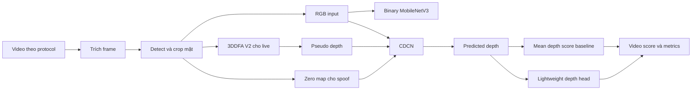
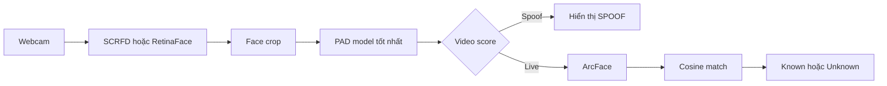

# Đặc tả nghiên cứu tinh gọn về nhận diện khuôn mặt có chống giả mạo bằng bản đồ độ sâu

**Tên tiếng Anh:** A Lean Experimental Study of Real Time Face Recognition with Depth Supervised Presentation Attack Detection  
**Loại đề tài:** Đồ án nghiên cứu môn Computer Vision  
**Quy mô nhóm:** 2 thành viên  
**Định hướng:** Tái lập, cải tiến nhỏ, thí nghiệm, đánh giá và chuẩn bị bản thảo paper  
**Phiên bản:** 2.0  
**Ngày cập nhật:** 19 tháng 9 năm 2026  
**Kế hoạch theo lượt báo cáo:** [KE_HOACH_THUC_HIEN_THEO_BUOI_HOC.md](KE_HOACH_THUC_HIEN_THEO_BUOI_HOC.md)

---

## 1. Quyết định phạm vi

Đây là một **lean research project**, không phải dự án xây sản phẩm nhận diện khuôn mặt hoàn chỉnh.

Trọng tâm nghiên cứu là **Presentation Attack Detection bằng depth supervision trên ảnh RGB**. Nhóm sẽ:

1. Tái lập một baseline phân loại nhị phân hiện đại nhưng nhẹ.
2. Tái lập CDCN dùng pseudo depth map.
3. Thêm một cải tiến nhỏ, rõ cơ chế và đo được.
4. Thực hiện ablation để biết thành phần nào tạo ra thay đổi.
5. Đánh giá bằng protocol và metric tương tự các bài báo.
6. Đặt kết quả cạnh các công trình gần nhất với điều kiện so sánh được giải thích rõ.
7. Ghép mô hình tốt nhất với ArcFace và webcam để tạo demo cuối.

Phần face recognition chỉ chứng minh PAD có thể bảo vệ một pipeline nhận diện. Nhóm không nghiên cứu detector mới, không huấn luyện ArcFace từ đầu, không xây web app, không triển khai cloud và không tối ưu cho doanh nghiệp.

### Kết quả cuối mong muốn

Một kết quả tốt không chỉ là webcam hiển thị `LIVE` hoặc `SPOOF`. Nhóm cần có:

- Một câu hỏi nghiên cứu cụ thể.
- Các baseline được chạy trong cùng điều kiện.
- Một thay đổi có kiểm soát so với baseline.
- Bảng metric đúng protocol.
- Ablation và phân tích lỗi.
- Số liệu hiệu quả tính toán.
- Một bản thảo paper ngắn nếu kết quả đủ rõ.

---

## 2. Chuyển yêu cầu của giảng viên thành đầu việc

| Yêu cầu của giảng viên | Cách nhóm thực hiện |
|---|---|
| Hai thành viên luân phiên báo cáo | A báo cáo lượt lẻ, B báo cáo lượt chẵn; cả hai đều có mặt và cùng trả lời câu hỏi |
| Thử nghiệm, modify và customize mô hình | Tái lập CDCN rồi thêm depth map classification head nhẹ; so sánh các chiến lược huấn luyện |
| So sánh với bài báo gần nhất | Theo dõi UCDCN 2024 vì gần kỹ thuật depth CDC nhất và CASO-PAD 2026 vì là bài mới nhất gần bài toán |
| Dùng tiêu chí tương tự nghiên cứu trước | APCER, BPCER, ACER, EER, ROC AUC; thêm tham số, FLOPs và latency |
| Báo cáo dài hơn | Mỗi lượt có literature update, phương pháp, tiến độ thí nghiệm, demo và kết luận tạm thời |
| Chuẩn bị giữa kỳ | Có bộ slide cố định, baseline đầu tiên, protocol, metric và kế hoạch cải tiến trước mốc giữa kỳ |
| Ưu tiên kết quả có thể viết paper | Lưu config, raw score, seed, ablation, failure cases và viết paper song song với thí nghiệm |

---

## 3. Phát biểu bài toán nghiên cứu

### 3.1 Bài toán

Đầu vào là một frame RGB chứa khuôn mặt. Mô hình cần dự đoán:

- Bản đồ độ sâu tương đối của vùng mặt.
- Điểm xác suất hoặc score cho hai lớp `bona fide` và `presentation attack`.

Đề tài tập trung vào ảnh in và video replay. Bản đồ độ sâu là **pseudo depth** sinh từ mô hình 3D face reconstruction, không phải số đo từ cảm biến depth.

### 3.2 Vấn đề của baseline

CDCN gốc dự đoán depth map rồi thường suy ra liveness score bằng thống kê đơn giản trên map. Cách này có hai hạn chế đáng thử nghiệm:

1. Depth map dự đoán không hoàn hảo; dùng trung bình map và một threshold cố định có thể bỏ qua pattern không gian.
2. Nếu chỉ tối ưu depth regression, model không nhận tín hiệu trực tiếp từ mục tiêu phân loại live hoặc spoof.

UCDCN 2024 cũng nhận xét rằng classifier có thể bù cho depth map chưa hoàn hảo và sử dụng huấn luyện nhiều giai đoạn. Nhóm sẽ kiểm tra một phiên bản nhỏ hơn, phù hợp tài nguyên của hai người.

### 3.3 Câu hỏi nghiên cứu chính

> Một classification head rất nhẹ học trực tiếp trên predicted depth map, kết hợp với depth supervision, có giảm ACER so với cách dùng mean depth score của CDCN mà không làm tăng đáng kể chi phí suy luận hay không?

### 3.4 Câu hỏi phụ

1. Binary MobileNetV3, CDCN depth only và CDCN có classification head khác nhau thế nào trên cùng protocol?
2. BCE và Focal Loss ảnh hưởng thế nào đến APCER và BPCER?
3. Staged training có giữ chất lượng depth map tốt hơn end-to-end training từ đầu không?
4. Cải tiến có nhất quán qua nhiều seed hay chỉ là dao động ngẫu nhiên?
5. Kết quả offline có chuyển thành hành vi ổn định trên webcam không?

### 3.5 Giả thuyết

- H1: Learned depth head có ACER thấp hơn fixed mean-depth scoring.
- H2: Staged training cho depth regression trước rồi mới học classifier sẽ cho depth map rõ hơn và kết quả ổn định hơn end-to-end từ đầu.
- H3: Focal Loss có thể giảm lỗi trên hard samples hoặc lớp thiểu số, nhưng không chắc cải thiện cả APCER lẫn BPCER.
- H4: Phần tăng tham số và latency của depth head nhỏ hơn 10 phần trăm so với CDCN baseline.

Nếu giả thuyết không được dữ liệu ủng hộ, đó vẫn là kết quả nghiên cứu hợp lệ nếu thiết kế thí nghiệm đúng và phân tích được nguyên nhân.

---

## 4. Đóng góp dự kiến

Nhóm không tuyên bố một phương pháp hoàn toàn mới trước khi làm literature review đầy đủ. Mức đóng góp phù hợp với đồ án hai người là:

1. **Reproduction:** tái lập một pipeline CDCN có depth supervision trên một protocol công khai.
2. **Controlled modification:** thêm một depth classification head nhỏ và thử hai chiến lược tối ưu.
3. **Ablation:** tách ảnh hưởng của classification head, loại loss và staged training.
4. **Evaluation:** so sánh độ chính xác, cân bằng hai loại lỗi và chi phí tính toán.
5. **Reproducibility:** công bố config, split, seed, raw score và script tính metric trong phạm vi giấy phép dữ liệu.
6. **Integration demo:** dùng mô hình tốt nhất chặn ảnh in hoặc replay trước khi ArcFace công bố danh tính.

### Tên tạm của phương pháp

Trong tài liệu nội bộ gọi phương pháp là **CDCN MT Lite**, viết tắt của CDCN with Lightweight Multi Task Depth Head. Đây chỉ là tên làm việc, không hàm ý novelty.

### Tiêu chí để có thể phát triển thành paper

Chỉ bắt đầu viết claim mạnh khi có đủ:

- Kết quả nhiều seed.
- Cùng protocol và preprocessing cho mọi model nội bộ.
- Ablation xác định thành phần tạo ra cải thiện.
- So sánh với bài báo trong điều kiện tương thích.
- Error analysis và limitation.
- Improvement không đổi dấu qua các seed hoặc có kiểm định hợp lý.

---

## 5. Phạm vi bắt buộc và phần loại bỏ

### 5.1 Phần bắt buộc

- Một dataset chính và một protocol chính thức.
- Ba cấu hình cốt lõi: binary baseline, CDCN baseline, CDCN MT Lite.
- Pseudo depth cho bona fide và zero map cho print hoặc replay.
- APCER, BPCER, ACER, EER và ROC AUC ở mức video.
- Parameter count, latency và FPS trên cùng máy.
- Ít nhất hai ablation có liên quan trực tiếp đến câu hỏi nghiên cứu.
- Nhiều seed cho baseline chính và phương pháp đề xuất.
- Demo webcam tối giản bằng mô hình tốt nhất.
- Báo cáo luân phiên và paper draft song song.

### 5.2 Không làm trong phạm vi chính

- Huấn luyện face detector hoặc ArcFace.
- Nhiều dataset bắt buộc.
- Mobile app, web app, database server, API hoặc cloud.
- Multi-face tracking phức tạp.
- Video Transformer hoặc rPPG.
- Camera IR, depth hoặc phần cứng ngoài webcam có sẵn.
- Mặt nạ 3D, deepfake và adversarial attack như mục tiêu bắt buộc.
- Hyperparameter search lớn.
- Tuyên bố state of the art nếu chưa tái lập cùng protocol.

### 5.3 Phần mở rộng chỉ làm khi lõi hoàn tất

- Cross-dataset trên một tập thứ hai.
- Patch Exchange augmentation từ DC-CDN.
- ONNX Runtime benchmark.
- Bootstrap confidence interval theo video.
- So sánh thêm CASO-PAD hoặc một lightweight adaptive operator baseline.

---

## 6. Các hướng học máy hiện đại liên quan

### 6.1 Binary classification bằng backbone nhẹ

Một backbone như MobileNetV3 hoặc EfficientNet được fine-tune để phân loại live và spoof. Ưu điểm là dễ huấn luyện và nhanh. Hạn chế là dễ học shortcut từ background, camera, độ nén hoặc viền màn hình.

CASO-PAD, công bố ngày 16 tháng 9 năm 2026, là ví dụ mới nhất gần bài toán. Mô hình dùng MobileNetV3 kết hợp grouped involution để tạo kernel phụ thuộc vị trí. Bài báo báo cáo 3,6 triệu tham số và 0,256 GFLOPs ở đầu vào 256 x 256. Kết quả của bài này là tham chiếu về xu hướng mô hình nhẹ, không mặc nhiên là đối chứng trực tiếp nếu protocol khác nhóm.

Nguồn: <https://www.nature.com/articles/s41598-026-67944-6>

### 6.2 Pixel wise và depth supervision

Mô hình học một map thay vì chỉ một nhãn. Bona fide có cấu trúc 3D tương đối, còn print và replay được gán map gần 0. CDCN dùng central difference convolution để nhấn mạnh gradient cục bộ và chi tiết giả mạo. Đây là hướng chính của đề tài.

Nguồn CDCN: <https://openaccess.thecvf.com/content_CVPR_2020/html/Yu_Searching_Central_Difference_Convolutional_Networks_for_Face_Anti-Spoofing_CVPR_2020_paper.html>

### 6.3 Multi task depth regression và classification

UCDCN, công bố năm 2024, dùng kiến trúc dạng UNet++, CDC, depth regression, classifier, Focal Loss và staged training. Công trình đánh giá trên OULU-NPU, SiW và Replay-Attack, đồng thời dùng APCER, BPCER và ACER trên protocol OULU-NPU. Đây là công trình gần nhất về cơ chế với cải tiến của nhóm.

Nguồn: <https://link.springer.com/article/10.1007/s40747-024-01397-0>

### 6.4 Transformer, descriptive operator và domain generalization

Các nghiên cứu mới dùng Vision Transformer, convolution mô tả cục bộ, contrastive learning, domain generalization hoặc foundation model để tăng khả năng tổng quát. Chúng phù hợp để trình bày bối cảnh nghiên cứu nhưng quá rộng cho implementation bắt buộc của nhóm hai người.

Ví dụ LDCformer 2026: <https://www.sciencedirect.com/science/article/pii/S0031320326002542>

Ví dụ phương pháp feature contrast tại FAS Challenge 2025: <https://openaccess.thecvf.com/content/ICCV2025W/FAS2025/papers/Wang_Adaptive_Face_Anti-Spoofing_Through_Enhanced_Data_Manipulation_and_Feature_Contrast_ICCVW_2025_paper.pdf>

### 6.5 Nhận xét lựa chọn

| Hướng | Giá trị nghiên cứu | Chi phí cho nhóm | Quyết định |
|---|---|---:|---|
| MobileNetV3 binary | Baseline hiện đại, nhẹ | Thấp | Làm |
| CDCN depth supervision | Đúng trọng tâm depth map | Trung bình | Làm |
| Multi-task depth classifier | Có chỗ để modify và ablation | Trung bình | Làm |
| Vision Transformer lớn | Hiện đại nhưng tốn dữ liệu và compute | Cao | Chỉ tổng quan |
| Domain generalization nhiều dataset | Có giá trị paper | Cao | Mở rộng |
| Temporal hoặc rPPG | Lệch câu hỏi chính | Cao | Không làm |

---

## 7. Phương pháp của nhóm

### 7.1 Pipeline nghiên cứu



### 7.2 Mô hình B0 Binary MobileNetV3

- Input: crop RGB 224 x 224 hoặc 256 x 256.
- Backbone: MobileNetV3 Small.
- Output: một live logit.
- Loss: BCE with logits.
- Vai trò: baseline nhanh, chứng minh lợi ích hoặc giới hạn của depth supervision.

Không gọi B0 là CASO-PAD. CASO-PAD có grouped involution và thiết kế riêng; MobileNetV3 ở đây chỉ là baseline cùng họ lightweight CNN.

### 7.3 Mô hình B1 CDCN depth only

- Input: crop RGB 256 x 256.
- Output: predicted depth map 32 x 32.
- Target live: pseudo depth từ 3DDFA V2.
- Target spoof: zero map.
- Loss: absolute depth loss và contrastive depth loss.
- Score: trung bình predicted depth trong face mask.

```text
L_depth = lambda_abs * L_abs + lambda_contrast * L_contrast
score_B1 = mean(D_pred trong face mask)
```

### 7.4 Mô hình M1 CDCN MT Lite

CDCN MT Lite giữ nguyên backbone và depth output của B1. Nhóm thêm một classifier nhỏ đọc predicted depth map:

```text
Predicted depth 1 x 32 x 32
    -> Conv 3 x 3, 8 channels, ReLU
    -> Conv 3 x 3, 16 channels, ReLU
    -> Global Average Pooling
    -> Linear 16 to 1
    -> live logit
```

Loss tổng:

```text
L_total = L_depth + lambda_cls * L_cls
```

`L_cls` được thử với BCE và Focal Loss. Classification score là sigmoid của live logit, không phải mean depth.

Lý do thiết kế:

- Head chỉ nhìn depth map nên vẫn giữ tính diễn giải.
- Head có thể học pattern không gian thay vì một threshold trên giá trị trung bình.
- Phần tăng tham số nhỏ và đo được.
- Cấu trúc đủ đơn giản để hai người triển khai, kiểm thử và ablate.

### 7.5 Hai chiến lược huấn luyện

**End to end**

- Khởi tạo backbone và head.
- Tối ưu `L_total` từ đầu.

**Staged training**

1. Train CDCN bằng `L_depth`.
2. Freeze CDCN, train depth head bằng `L_cls`.
3. Unfreeze toàn bộ và fine-tune bằng `L_total` với learning rate nhỏ hơn.

Đây là biến độc lập quan trọng. Không đồng thời thay architecture, augmentation và learning rate giữa hai chiến lược.

### 7.6 Pseudo depth

Với bona fide:

1. Detect và crop mặt.
2. Chạy 3DDFA V2.
3. Render depth và face mask.
4. Chuẩn hóa robust trong vùng mặt về 0 đến 1.
5. Resize map về 32 x 32.

Với print hoặc replay, target là zero map. Nếu 3DDFA thất bại trên live, sample phải được đánh dấu lỗi; không đổi thành spoof.

Nguồn 3DDFA V2: <https://github.com/cleardusk/3DDFA_V2>

---

## 8. Dữ liệu và protocol

### 8.1 Chỉ chọn một benchmark bắt buộc

**Lựa chọn ưu tiên:** OULU-NPU Protocol 1 nếu nhóm được cấp quyền dữ liệu trước hạn chốt ở lượt báo cáo đầu tiên.

Lý do:

- Có protocol chính thức.
- CDCN và UCDCN đều báo cáo trên OULU-NPU.
- Metric APCER, BPCER và ACER phù hợp yêu cầu giảng viên.

Trang dataset: <https://sites.google.com/site/oulunpudatabase/>

**Phương án thay thế:** Replay-Attack nếu không được cấp OULU-NPU đúng hạn.

Trang dataset: <https://www.idiap.ch/dataset/replayattack>

Nhóm không chạy cả hai dataset ngay từ đầu. Cross-dataset chỉ được làm sau khi bảng thí nghiệm chính hoàn tất.

### 8.2 Nguyên tắc split

- Dùng đúng official protocol.
- Không chia ngẫu nhiên theo frame.
- Tất cả frame của một video ở cùng split.
- Không chọn threshold trên test.
- Không dùng test để chọn epoch, loss, augmentation hoặc architecture.
- Mỗi model dùng cùng manifest và cùng frame sampling.

### 8.3 Frame sampling

- Train: lấy số frame cố định trên mỗi video, phân bố đều theo thời gian.
- Validation và test: dùng cùng một quy tắc cố định cho mọi model.
- Video score: mean hoặc median frame score; lựa chọn trên validation rồi khóa.

### 8.4 Manifest tối thiểu

```csv
sample_id,split,subject_id,video_id,frame_index,image_path,depth_path,label,attack_type
```

Script validator phải kiểm tra file tồn tại, nhãn, sample trùng, video leakage và subject leakage nếu protocol yêu cầu.

---

## 9. Bộ tiêu chí đánh giá

### 9.1 Metric PAD chính

Với score cao là live và threshold `t`:

```text
APCER(t) = số attack có score >= t / tổng attack
BPCER(t) = số live có score < t / tổng live
ACER(t)  = (APCER(t) + BPCER(t)) / 2
```

- **APCER:** attack bị nhầm thành bona fide.
- **BPCER:** bona fide bị nhầm thành attack.
- **ACER:** trung bình APCER và BPCER.
- **EER:** điểm hai loại lỗi xấp xỉ nhau.
- **ROC AUC:** đánh giá thứ hạng score trên toàn bộ threshold.

Các metric này phải tính ở mức video nếu protocol đánh giá video.

Thông tin tiêu chuẩn ISO IEC 30107-3:2023: <https://www.iso.org/standard/79520.html>

### 9.2 Metric hiệu quả tính toán

- Số tham số trainable.
- FLOPs hoặc MACs nếu công cụ hỗ trợ đúng CDC.
- Model size.
- Latency p50 và p95 với batch size 1.
- FPS trên cùng máy, cùng input size và cùng warmup.

### 9.3 Metric hỗ trợ phân tích

- Depth MAE trên validation.
- Contrastive depth loss.
- Confusion theo print và replay.
- Phân phối score live và spoof.
- Tỷ lệ sample 3DDFA thất bại.

### 9.4 Quy tắc chọn threshold

1. Sinh video score trên validation.
2. Chọn threshold theo minimum ACER hoặc tiêu chí protocol.
3. Lưu threshold cùng run artifact.
4. Khóa threshold.
5. Chạy test một lần cho bảng cuối.

### 9.5 Quy tắc so sánh với paper

Một con số chỉ được gọi là so sánh trực tiếp khi giống:

- Dataset.
- Protocol.
- Split.
- Đơn vị frame hoặc video.
- Metric và cách chọn threshold.
- Attack types được tính.

Nếu không đủ các điều kiện trên, đưa kết quả paper vào bảng **contextual comparison** và ghi rõ `không so trực tiếp`.

---

## 10. Ma trận thí nghiệm tối thiểu

| ID | Mô hình | Classification head | Loss phân loại | Training | Mục đích |
|---|---|---|---|---|---|
| E0 | MobileNetV3 | RGB head | BCE | End to end | Binary baseline |
| E1 | CDCN | Không | Không | Depth only | Depth baseline |
| E2 | CDCN MT Lite | Có | BCE | Freeze backbone rồi train head | Đo tác dụng của learned depth scoring |
| E3 | CDCN MT Lite | Có | BCE | End to end | So sánh chiến lược train |
| E4 | CDCN MT Lite | Có | Focal | Staged và fine-tune | Cấu hình đề xuất |

### 10.1 Run budget cho nhóm hai người

- Debug bằng subset nhỏ và một seed.
- Chạy E0 đến E4 một seed để sàng lọc.
- Chạy lại E1 và cấu hình tốt nhất bằng tối thiểu 3 seed.
- Nếu E2, E3 và E4 gần nhau, ưu tiên thêm seed thay vì thêm model.
- Không chạy test sau mỗi lần sửa; dùng validation.

### 10.2 Ablation bắt buộc

1. Fixed mean-depth score so với learned depth head.
2. End-to-end so với staged training.
3. BCE so với Focal Loss nếu dữ liệu và thời gian cho phép.

Không gọi E0 với E4 là ablation vì hai model khác backbone và supervision.

### 10.3 Bảng kết quả nội bộ

```text
Run | Model | Seed | APCER | BPCER | ACER | EER | AUC | Params | Latency p50
```

### 10.4 Bảng đối chiếu paper

| Công trình | Năm | Dataset và protocol | Supervision | Metric paper | Kết quả nhóm | So trực tiếp? |
|---|---:|---|---|---|---|---|
| CDCN | 2020 | Điền đúng protocol | Depth | APCER, BPCER, ACER hoặc HTER | | Chỉ khi cùng protocol |
| UCDCN | 2024 | Điền đúng protocol | Depth và classification | APCER, BPCER, ACER | | Chỉ khi cùng protocol |
| CASO-PAD | 2026 | Điền đúng protocol | Binary RGB | Accuracy, AUC, HTER, EER | | Có thể chỉ contextual |
| Deep Spatial Gradient and Temporal Depth | 2020 | OULU-NPU, SiW và cross-dataset | Spatial gradient và temporal depth | ACER, EER, HTER | | Contextual nếu khác protocol |
| Dual-Cross Central Difference Network | 2021 | OULU-NPU, SiW, CASIA-MFSD và Replay-Attack | Static-dynamic CDC | ACER, EER, HTER | | Contextual nếu khác protocol |
| CDCN MT Lite | 2026 | Protocol nhóm chọn | Depth và classification | APCER, BPCER, ACER, EER, AUC | | Kết quả nhóm |

Mọi ô kết quả từ paper phải được chép từ đúng bảng và kiểm tra lại trước khi đưa vào slide. Không dùng số từ abstract nếu abstract và protocol table không cùng cách đánh giá.

---

## 11. Nhận diện khuôn mặt và demo cuối

### 11.1 Vai trò

Recognition là lớp minh họa. Chỉ triển khai sau khi E1 và ít nhất một cấu hình M1 chạy được.

### 11.2 Pipeline tối giản



### 11.3 Giới hạn triển khai

- Gallery 2 đến 5 người.
- Một mặt trong frame.
- Score smoothing bằng median window đơn giản.
- UI OpenCV.
- Không lưu frame mặc định.
- Không làm tracking nâng cao, API hoặc database.

### 11.4 Metric demo

Demo định tính không thay metric benchmark. Nhóm chỉ báo thêm:

- Tỷ lệ print hoặc replay bị chặn trong số lượt thử.
- Tỷ lệ live được cho qua.
- Time to decision.
- FPS.

---

## 12. Tổ chức mã nguồn tinh gọn

```text
DeepFace-PAD/
├── DAC_TA_HE_THONG_NHAN_DIEN_KHUON_MAT_PAD_DEPTH_MAP.md
├── KE_HOACH_THUC_HIEN_THEO_BUOI_HOC.md
├── README.md
├── configs/
│   ├── e0_mobilenet.yaml
│   ├── e1_cdcn.yaml
│   ├── e2_head_frozen.yaml
│   ├── e3_joint_bce.yaml
│   └── e4_staged_focal.yaml
├── data/
│   ├── README.md
│   └── manifests/
├── src/
│   └── deepface_pad/
│       ├── data.py
│       ├── depth.py
│       ├── models/
│       │   ├── mobilenet_baseline.py
│       │   ├── cdcn.py
│       │   └── depth_head.py
│       ├── losses.py
│       ├── metrics.py
│       ├── train.py
│       ├── evaluate.py
│       └── demo.py
├── scripts/
│   ├── prepare_data.py
│   ├── generate_depth.py
│   ├── validate_manifest.py
│   ├── run_experiment.py
│   ├── evaluate.py
│   └── make_figures.py
├── tests/
├── runs/
├── reports/
│   ├── figures/
│   ├── tables/
│   └── paper/
└── slides/
```

Chỉ tách thêm module khi file thực sự khó quản lý. Không tạo kiến trúc phần mềm phức tạp để trông giống dự án lớn.

---

## 13. Artifact và tái lập

Mỗi run phải lưu:

```text
runs/E4_seed42_timestamp/
├── config.yaml
├── environment.txt
├── manifest_checksum.json
├── depth_input_snapshot.json   # E1, E3, E4
├── train_log.csv
├── best.ckpt
├── val_scores.csv
├── threshold.json
├── test_scores.csv
├── metrics.json
└── figures/
```

Quy tắc:

- Không đặt tên `final2`, `best_new` hoặc `last_really_final`.
- Không sửa config sau khi run đã bắt đầu.
- Không nhập số thủ công vào bảng kết quả.
- Figure và table phải sinh từ raw score.
- Dataset và weight lớn không commit Git.
- Ghi model source và license.

---

## 14. Error analysis

Mỗi cấu hình chính phải phân tích:

- False live: attack lọt qua.
- False spoof: người thật bị chặn.
- Print so với replay.
- Ánh sáng, blur, pose và kích thước mặt nếu metadata cho phép.
- Predicted depth của case đúng và sai.
- Score distribution và vùng overlap.

Câu hỏi quan trọng:

1. Learned depth head sửa được loại lỗi nào của mean depth?
2. Head có học artifact ngoài vùng mặt không?
3. Focal Loss giảm APCER nhưng làm BPCER tăng hay ngược lại?
4. Staged training có tạo depth map rõ hơn nhưng classification kém hơn không?
5. Improvement có đi kèm tăng latency đáng kể không?

---

## 15. Kế hoạch viết paper

### 15.1 Working title

**Learning to Classify Imperfect Pseudo Depth Maps for Lightweight RGB Face Presentation Attack Detection**

Tên này chỉ dùng nội bộ cho đến khi kết quả chứng minh được luận điểm.

### 15.2 Cấu trúc bản thảo

1. Introduction: fixed mean-depth scoring có thể bỏ qua cấu trúc không gian.
2. Related work: binary RGB, depth supervised CDC, multi-task FAS và lightweight recent methods.
3. Method: CDCN baseline, depth head và staged training.
4. Experimental setup: dataset, protocol, pseudo depth, metric và run budget.
5. Results: main table, ablation, efficiency và visualization.
6. Discussion: khi head giúp, khi không giúp, giới hạn zero-depth assumption.
7. Conclusion.

### 15.3 Hình và bảng cần tích lũy từ đầu

- Figure 1: pipeline tổng thể.
- Figure 2: CDCN MT Lite.
- Figure 3: RGB, target depth, predicted depth và error map.
- Figure 4: ROC hoặc score distribution.
- Table 1: so sánh paper.
- Table 2: main results.
- Table 3: ablation.
- Table 4: params và latency.

### 15.4 Điều kiện dừng paper

Nếu không có improvement ổn định, nhóm vẫn viết báo cáo nghiên cứu dạng reproduction and negative result, nhưng không tuyên bố mô hình tốt hơn. Giá trị khi đó nằm ở kiểm chứng có kiểm soát và phân tích nguyên nhân.

---

## 16. Tiêu chí nghiệm thu

### 16.1 Nghiệm thu giữa kỳ

- [ ] Có ba slide tổng quan phương pháp hiện đại, phương pháp nhóm và đánh giá; chỉ làm sau khi Lượt 3 đủ bằng chứng.
- [x] Có bài CDCN, UCDCN và CASO-PAD trong literature table.
- [x] Chốt CASIA-FASD và split subject-disjoint làm protocol phát triển giữa kỳ; benchmark cuối vẫn chờ hạn 27/09/2026.
- [x] Manifest validator pass trên 12.000 frame và 600 video CASIA.
- [x] Có metric script được test bằng ví dụ tính tay.
- [x] E0 chạy end to end trên validation; threshold đã khóa trước test.
- [x] Queue 3DDFA hoàn tất 3.000 frame bona fide và 9.000 attack zero-map, không có persistent failure; provenance và QA đã khóa.
- [x] Official-CDCN E1 depth-only hoàn tất smoke và full 30 epoch; best checkpoint epoch 25, threshold validation và locked test đã đóng băng. Run compact cũ chỉ giữ nhãn E1-Lite Pilot.
- [x] Có batch visualization, face-crop demo và 12 predicted-depth case validation official-E1 thực tế.
- [x] Có training curves và test score distributions E0–official-E1 sinh lại từ raw artifact đóng băng.
- [x] Hai thành viên đã phân lịch báo cáo luân phiên.

### 16.2 Nghiệm thu cuối

- [ ] E0, E1 và ít nhất hai biến thể của M1 hoàn tất.
- [ ] E1 và cấu hình tốt nhất có nhiều seed.
- [ ] Threshold chỉ chọn trên validation.
- [ ] Bảng APCER, BPCER, ACER, EER và AUC ở mức video.
- [ ] Có params, latency và FPS.
- [ ] Có ablation và error analysis.
- [ ] Có bảng paper comparison ghi rõ mức tương thích.
- [ ] Demo ArcFace chỉ chạy sau PAD.
- [ ] Có paper draft hoặc báo cáo theo cấu trúc paper.
- [ ] Không có claim vượt quá dữ liệu.

---

## 17. Rủi ro và cách cắt phạm vi

| Rủi ro | Cách xử lý lean |
|---|---|
| Không lấy được OULU-NPU | Chuyển sang Replay-Attack tại hạn chốt, không chờ thêm |
| 3DDFA V2 khó chạy | Sinh offline trên subset, dùng môi trường cô lập hoặc ONNX; ghi failure rate |
| CDCN khó tái lập đúng số paper | Báo reproduction gap, giữ cùng protocol nội bộ |
| Compute thiếu | Một seed sàng lọc, ba seed chỉ cho E1 và model tốt nhất |
| Focal Loss không giúp | Giữ như negative ablation |
| Depth head không giúp | Phân tích score overlap và depth quality; không thêm model tùy tiện |
| Demo webcam khác domain | Trình bày như demo định tính, không gộp với benchmark |
| Trễ lịch | Bỏ E0 hoặc demo recognition trước; không bỏ E1, M1, metric và ablation |

### Thứ tự giữ lại khi phải cắt giảm

1. Protocol và metric đúng.
2. CDCN baseline.
3. Depth head modification.
4. Ablation head và training strategy.
5. Nhiều seed.
6. Paper comparison.
7. Webcam PAD demo.
8. ArcFace integration.
9. Cross-dataset và ONNX.

---

## 18. Tài liệu tham khảo cốt lõi

1. Yu, Z. và cộng sự. **Searching Central Difference Convolutional Networks for Face Anti-Spoofing**, CVPR 2020. <https://openaccess.thecvf.com/content_CVPR_2020/html/Yu_Searching_Central_Difference_Convolutional_Networks_for_Face_Anti-Spoofing_CVPR_2020_paper.html>
2. Zhang, J. và cộng sự. **UCDCN A Nested Architecture Based on Central Difference Convolution for Face Anti-Spoofing**, Complex and Intelligent Systems, 2024. <https://link.springer.com/article/10.1007/s40747-024-01397-0>
3. Khan, S. **Face Presentation Attack Detection via Content-Adaptive Spatial Operators**, Scientific Reports, công bố 16 tháng 9 năm 2026. <https://www.nature.com/articles/s41598-026-67944-6>
4. Wang, Z. và cộng sự. **Deep Spatial Gradient and Temporal Depth Learning for Face Anti-Spoofing**, CVPR 2020. <https://openaccess.thecvf.com/content_CVPR_2020/html/Wang_Deep_Spatial_Gradient_and_Temporal_Depth_Learning_for_Face_Anti-Spoofing_CVPR_2020_paper.html>
5. Yu, Z. và cộng sự. **Dual-Cross Central Difference Network for Face Anti-Spoofing**, IJCAI 2021. <https://www.ijcai.org/proceedings/2021/177>
6. Yu, Z. và cộng sự. **Deep Learning for Face Anti-Spoofing A Survey**, IEEE TPAMI. <https://github.com/ZitongYu/DeepFAS>
7. Guo, J. và cộng sự. **3DDFA V2**, ECCV 2020. <https://github.com/cleardusk/3DDFA_V2>
8. Deng, J. và cộng sự. **ArcFace**, CVPR 2019. <https://openaccess.thecvf.com/content_CVPR_2019/html/Deng_ArcFace_Additive_Angular_Margin_Loss_for_Deep_Face_Recognition_CVPR_2019_paper.html>
9. ISO IEC 30107-3:2023. **Biometric Presentation Attack Detection Testing and Reporting**. <https://www.iso.org/standard/79520.html>

---

## Phụ lục A Phiếu mô tả mỗi experiment

```markdown
## Run ID

### Giả thuyết

### Thay đổi duy nhất so với baseline

### Dataset và protocol

### Config và seed

### Tiêu chí chọn checkpoint

### Threshold validation

### Kết quả validation

### Kết quả test

### Failure cases

### Kết luận có được dữ liệu ủng hộ hay không
```

## Phụ lục B Checklist trước khi đưa số lên slide

- [ ] Số lấy từ artifact, không chép từ trí nhớ.
- [ ] Đúng split và protocol.
- [ ] Đúng frame-level hoặc video-level.
- [ ] Threshold lấy từ validation.
- [ ] Có run ID và seed.
- [ ] Paper comparison dùng cùng metric hoặc đã ghi contextual.
- [ ] Không chọn chỉ run tốt nhất để đại diện cho nhiều seed.
- [ ] Có cả APCER và BPCER, không chỉ accuracy.
- [ ] Có cấu hình máy khi báo latency.
- [ ] Claim trên slide không mạnh hơn bằng chứng.

