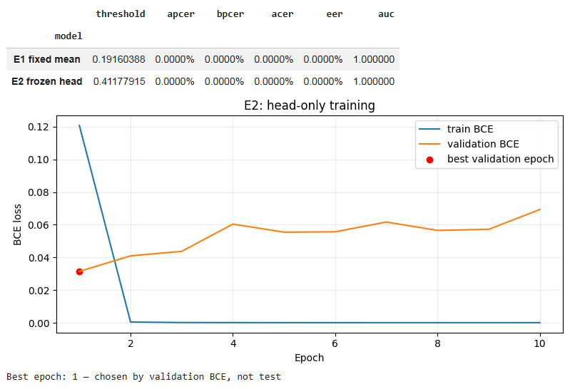
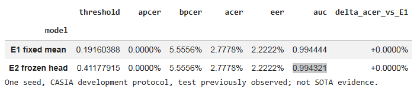
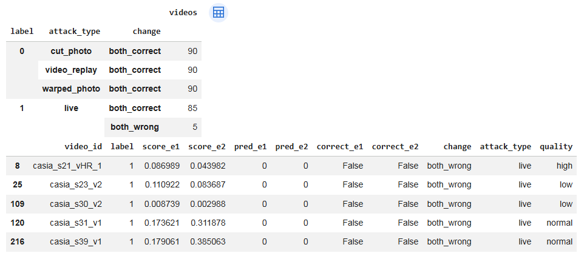
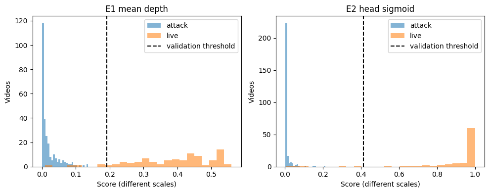
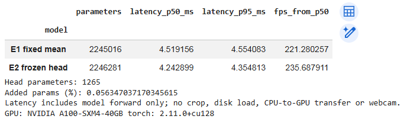

# Kết quả Lượt 4: frozen learned depth head

Ngày ghi nhận: 01/10/2026. Nguồn là log cấu hình và sáu screenshot Colab do người
dùng cung cấp. Chưa tải hoặc kiểm tra độc lập raw CSV, JSON và checkpoint trên Drive.
Các số dưới đây chép từ output thực đã gửi, không phải kết quả synthetic local.
Ảnh gốc được lưu nguyên vẹn trong `reports/figures/round4_e2_seed42/`.

## Kết luận phục vụ báo cáo

Head nhỏ đã học được cách chuyển predicted depth thành score phân loại, nhưng
chưa cải thiện kết quả E1 trên run này: cùng ACER 2,7778%, cùng năm live video
bị từ chối, không sửa được lỗi nào và không tạo thêm lỗi tại hai ngưỡng đã khóa.
AUC E2 thấp hơn rất nhẹ. Đây là negative result của cấu hình frozen head hiện
tại, chưa đủ kết luận learned depth head nói chung vô ích hoặc hai model tương
đương trên dữ liệu khác.

## Thiết lập và bằng chứng tái lập

- E1: `CASIA_E1_CDCN_OFFICIAL_seed42_20260921T114029Z`.
- E2: `CASIA_E2_CDCN_OFFICIAL_HEAD_FROZEN_seed42_20261001T155213Z`.
- E1 checkpoint SHA256: `679810c001e526cafed8685fe731a7d5c539fd3fb9c5a9fb31725b7dbdf57024`.
- GPU: NVIDIA A100-SXM4-40GB; torch 2.11.0+cu128.
- 12.000 frame: 3.000 bona fide depth và 9.000 attack zero-map.
- RGB 256, official normalization, seed 42, batch 8, mean video aggregation.
- Official CDCN weights và BatchNorm đóng băng; head Conv 1→8→16, GAP, Linear.
- Adam lr=0.001, weight decay=0.0001, BCE, 10 epoch.
- Log: `PASS: same manifest, exact backbone tensors, identical depth, reproduced E1 validation`.
- Checkpoint tốt nhất: epoch 1, chọn bằng validation BCE. Metric E2 dùng checkpoint
  này, không phải mặc định epoch 10.
- Ngưỡng từ validation: E1 0,19160388; E2 0,41177915. Hai thang điểm khác nhau.

## Kết quả ở mức video

Validation: cả E1 và E2 đều APCER=BPCER=ACER=EER=0%, AUC=1.

CASIA development test đã được xem từ Lượt 3:

| Mô hình | APCER | BPCER | ACER | EER | AUC |
|---|---:|---:|---:|---:|---:|
| E1 fixed mean | 0,0000% | 5,5556% | 2,7778% | 2,2222% | 0,994444 |
| E2 frozen head | 0,0000% | 5,5556% | 2,7778% | 2,2222% | 0,994321 |

AUC delta từ số hiển thị: -0,000123. Không có khoảng tin cậy hoặc nhiều seed để
khẳng định khác biệt nhỏ này có ý nghĩa thống kê. Không so sánh các giá trị score
E1/E2 như cùng thang đo và không coi histogram gần 0/1 là bằng chứng tốt hơn.

## Phân tích lỗi ghép cặp

Tổng 360 video test: 270 attack và 90 live. Cả hai mô hình đúng cả 270 attack,
đúng cùng 85 live và sai cùng 5 live. BPCER=5/90, ACER=(0+5/90)/2.
`fixed_by_E2=0`, `new_error_E2=0`, `both_wrong=5`, `both_correct=355`.

| Video cùng sai | Chất lượng | E1 score | E2 score |
|---|---|---:|---:|
| casia_s21_vHR_1 | high | 0,086989 | 0,043982 |
| casia_s23_v2 | low | 0,110922 | 0,083687 |
| casia_s30_v2 | low | 0,008739 | 0,002988 |
| casia_s31_v1 | normal | 0,173621 | 0,311878 |
| casia_s39_v1 | normal | 0,179061 | 0,385063 |

Mọi score này đều dưới ngưỡng tương ứng nên người thật bị dự đoán spoof. Có cả
video high/normal/low, chưa có bằng chứng cho rằng độ phân giải thấp giải thích
toàn bộ lỗi. Cần xem RGB/predicted depth của năm video trước khi kết luận nguyên
nhân. Backbone đóng băng nên E2 không thay chất lượng predicted depth.

## Đọc training curve

Train BCE giảm gần 0 từ epoch 2; validation BCE thấp nhất ở epoch 1 rồi tăng
và dao động. Mẫu này phù hợp với việc train thêm làm mô hình quá tự tin trên
train và kém hơn về validation BCE. Nó không tự chứng minh validation ACER
ở các epoch sau tăng: chưa có bảng metric từng epoch. BCE xét cả độ tự tin;
các dự đoán đúng vẫn có thể có BCE khác nhau.

Không lấy checkpoint epoch 10 hoặc sửa ngưỡng để cải thiện test đã thấy.

## Hiệu quả tính toán

| Mô hình | Params | Latency p50 ms | Latency p95 ms | FPS từ p50 |
|---|---:|---:|---:|---:|
| E1 fixed mean | 2.245.016 | 4,519156 | 4,554083 | 221,280257 |
| E2 frozen head | 2.246.281 | 4,242899 | 4,354813 | 235,687911 |

Head tăng 1.265 tham số, tức 0,05635%. Trong lần đo này E2 p50 thấp hơn 0,276257
ms (khoảng 6,11%), nhưng notebook đo E1 rồi E2 theo thứ tự cố định, mỗi model 10
warmup và 50 lần đo. Chưa có nhiều lượt hoặc thứ tự đảo để loại ảnh hưởng clock,
warmup và tải GPU. Vì thế chỉ báo số quan sát, không khẳng định E2 nhanh hơn
hoặc chứng minh latency không tăng dưới 10%. Có thể nói chưa quan sát thấy phần
tăng latency rõ ràng ở phép đo sơ bộ này.

Đây là latency forward RGB→score batch=1; không gồm detector, crop, đọc ảnh,
CPU→GPU transfer hoặc webcam. FPS là 1000/p50, không phải FPS hệ thống camera.

## Lời trình bày khoảng một phút

“Ở lượt 4, chúng em giữ nguyên checkpoint CDCN và toàn bộ predicted depth,
chỉ học một head 1.265 tham số. Checkpoint được chọn ở epoch 1 bằng validation
BCE. Trên CASIA test phát triển, E1 và E2 cùng ACER 2,7778% và cùng sai năm
video người thật. Vì vậy cấu hình frozen head này chưa cải thiện baseline.
Chi phí tham số tăng 0,056%, còn latency cần đo lặp để có kết luận chắc hơn.
Kết quả giúp nhóm phân biệt tác động của cách đọc map với việc thay đổi backbone;
bước tiếp theo trong plan là kiểm tra joint training, với lựa chọn cấu hình
dựa trên validation và xác nhận cuối trên benchmark độc lập.”

## Artifact cần giữ trên Drive

Run: `/content/drive/MyDrive/face-pad/runs/CASIA_E2_CDCN_OFFICIAL_HEAD_FROZEN_seed42_20261001T155213Z`.
Report: `/content/drive/MyDrive/face-pad/reports/CASIA_E2_CDCN_OFFICIAL_HEAD_FROZEN_seed42_20261001T155213Z`.

Giữ config, manifest checksum, initial checkpoint SHA, model provenance,
train_log.csv, best.ckpt, threshold.json, metrics.json, test_metrics.json,
comparison_freeze.json, frame/video scores, paired error CSV, efficiency CSV và
figures; lưu bản notebook có output riêng trên Drive. Chưa kiểm chứng độc lập
các file này trong workspace hiện tại.
